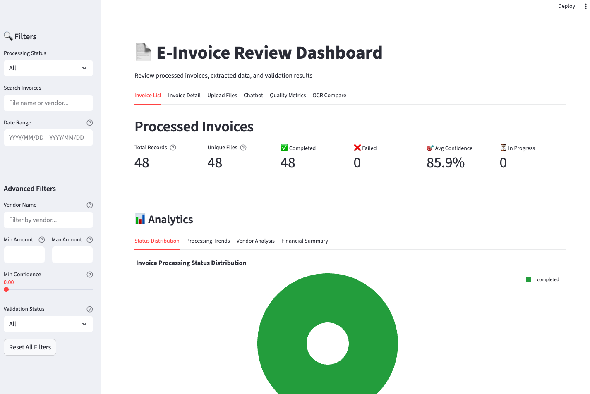
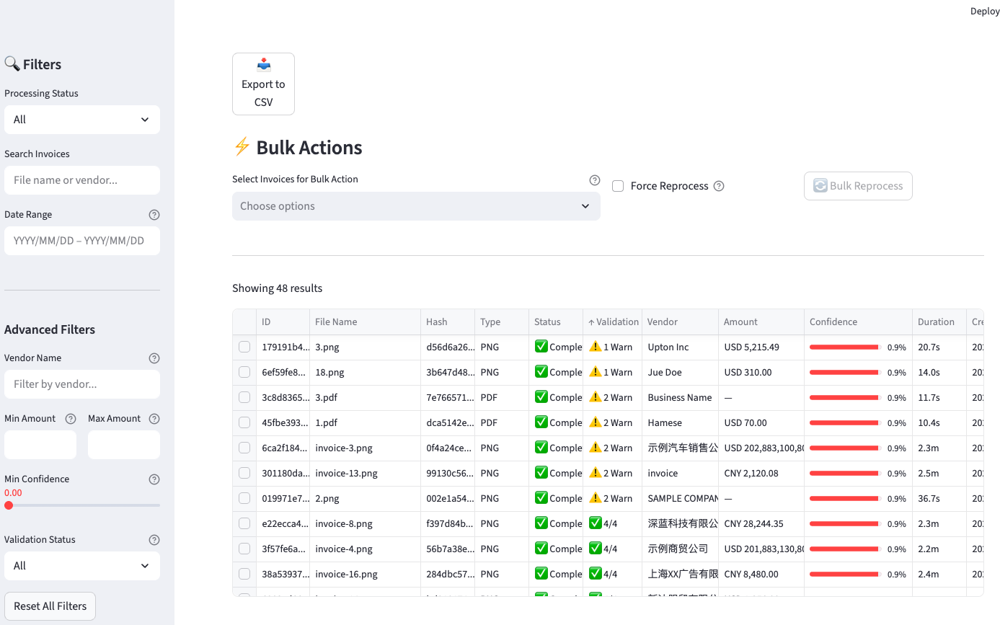
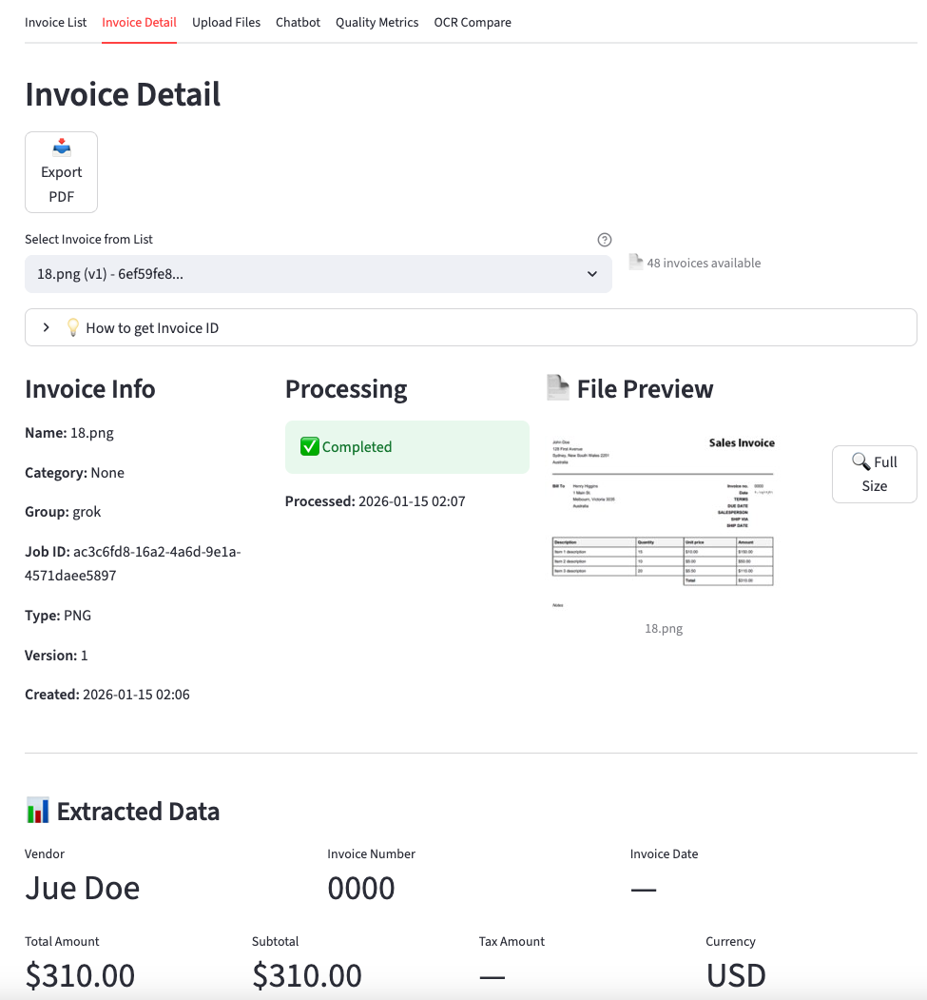
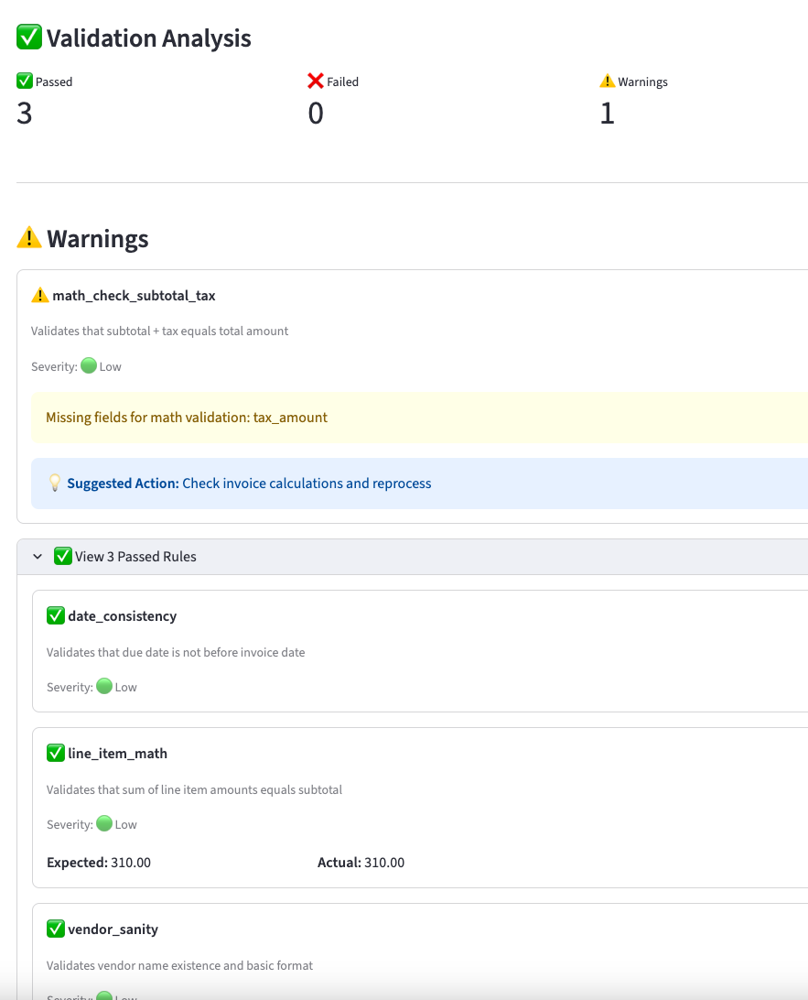
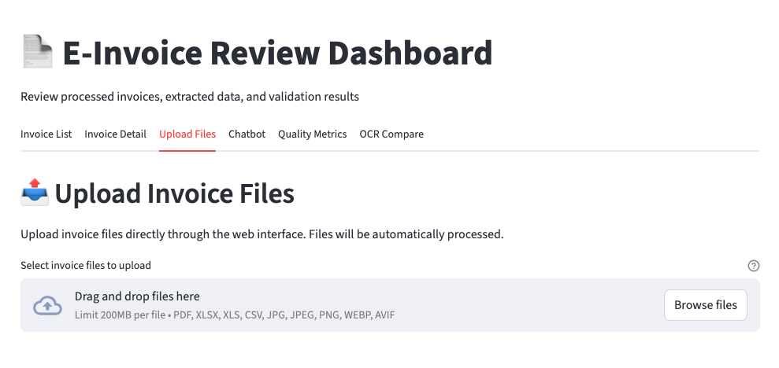
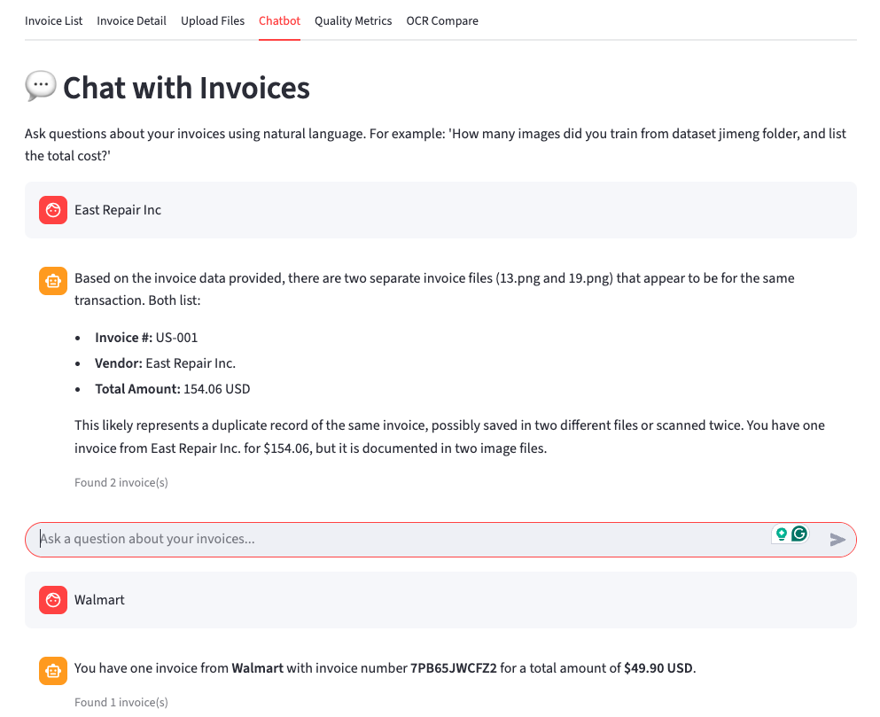
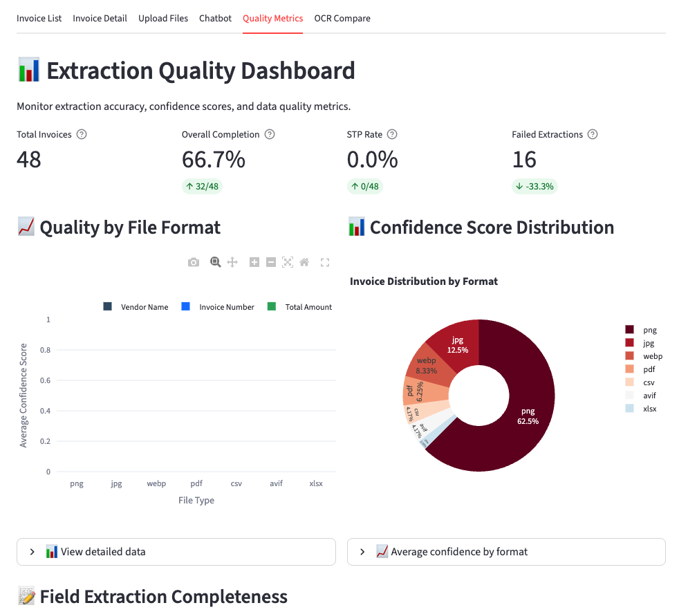
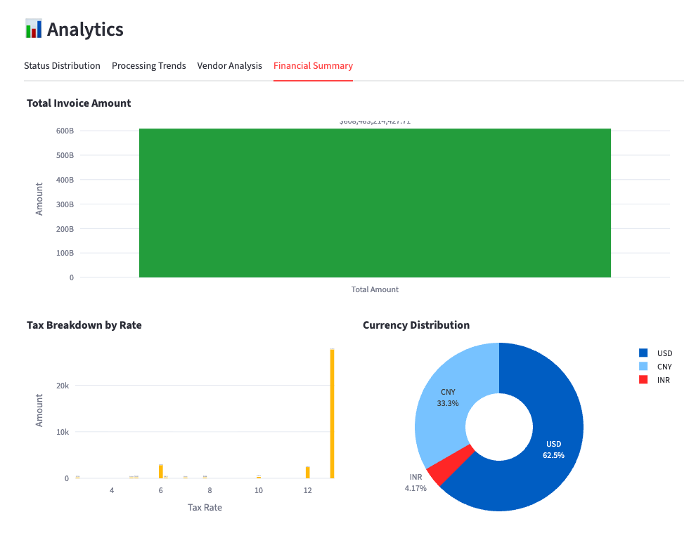
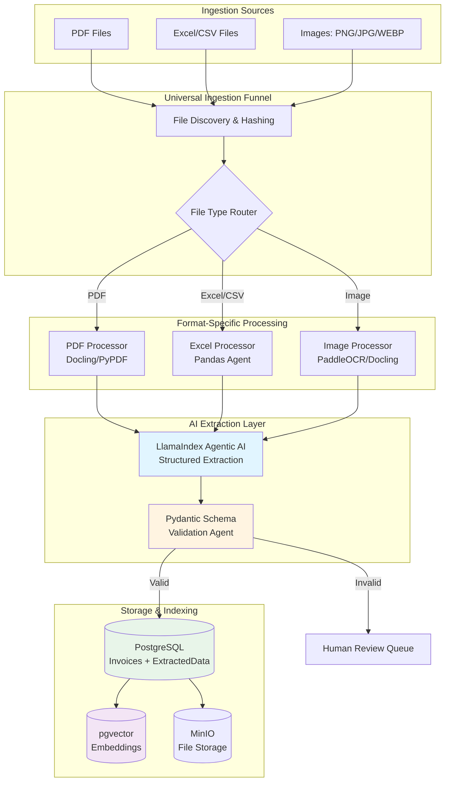
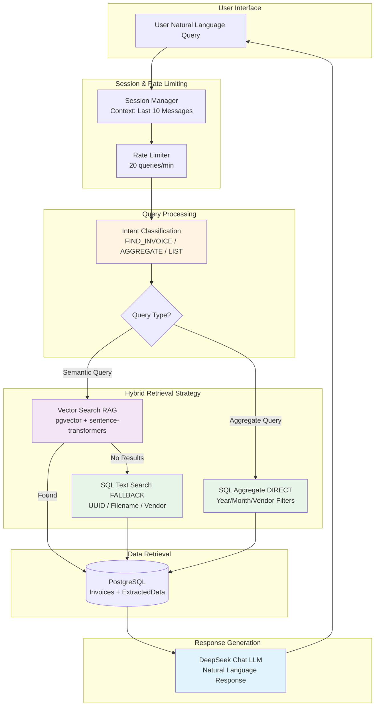

# AI-Invoice: AI-driven accounts payable automation

**AI-Invoice** ingests heterogeneous invoices (PDF, Excel, images) and turns them into structured fields using LLM-led pipelines—**without maintaining vendor-specific templates**.

It covers the lifecycle from ingestion through extraction, validation, and routing. Broader goals (GL coding, approvals, ERP handoff) are on the [roadmap](#roadmap).

---

## What this platform does

| Capability | Description |
| :--- | :--- |
| **Zero-template extraction** | The model reads layout and content variations and maps them to shared schemas—no fixed per-vendor layouts or manual template maintenance. |
| **Self-correcting validation** | Failed checks can trigger alternate extraction strategies before an item is sent to human review. |
| **Multi-format ingestion** | One funnel for **PDF**, **Excel/CSV**, and **images** (PNG, JPG, WEBP, etc.). |
| **Duplicate control** | Content **hashing** and **versioning** to skip or control reprocessing ([details](./docs/duplicate-processing-logic.md)). |
| **RAG & chat** | Query processed data via **pgvector** + sentence-transformers, with **SQL fallbacks** when vectors are unavailable (see RAG diagram below). |
| **Resilience** | Pluggable-style configuration for runtime behavior ([resilient configuration](./docs/resilient-configuration.md)). |
| **Scale-out helpers** | CLI **`--concurrency`** (default `2`) and **`--background`** to queue work through the API/job path. |
| **REST API** | Async processing, uploads, exports, chat, quality, and OCR admin/compare under `/api/v1`. |

---

## Tech stack

Aligned with `pyproject.toml` (exact versions live there).

| Layer | Technology |
| :--- | :--- |
| **AI / extraction** | LlamaIndex (structured extraction), DeepSeek (chat / LLM), Docling (PDF → markdown) |
| **OCR** | **PaddleOCR** for raster images (and rasterized PDF pages in OCR fallback); PDF text via Docling / PyPDF |
| **Persistence** | PostgreSQL, **pgvector**, **pgqueuer** |
| **API** | **FastAPI** (`interface/api/`), async SQLAlchemy, Pydantic v2 |
| **UI** | **Streamlit** (`interface/dashboard/`); optional **Next.js** in `frontend/` (same API) |
| **Migrations** | **Alembic** |
| **Deployment** | **Docker Compose**; local workflows via `bin/*.sh` |

PyPI keywords include `invoice`, `ocr`, `rag`, `fastapi`, `streamlit`; other heavy deps (PaddleOCR, Docling, LlamaIndex, …) are listed in `pyproject.toml`.

---

## Repository layout

| Path | Role |
| :--- | :--- |
| **`brain/`** | Agent-style logic (e.g. chatbot orchestration, retrieval helpers) |
| **`core/`** | Config, database, models, OCR registry, resilience hooks |
| **`ingestion/`** | File discovery, PDF / Excel / image processors, handoff to extraction |
| **`interface/`** | FastAPI REST API and Streamlit UI |
| **`frontend/`** | Next.js + Tailwind + shadcn (optional) |
| **`scripts/`** | CLI (e.g. `process_invoices.py`: concurrency, background queue, recursive scan) |
| **`specs/`** | Design specs, OpenAPI drafts, migration plans |
| **`tests/`** | Pytest (unit, integration, contract) |
| **`bin/`** | Setup, API, dashboard, batch processing |

Folders like **`.cursor/`** or **`.agent/`** (if present) are editor-only—not part of the runtime app.

---

## Screenshots

| Overview | Invoice list & bulk actions |
|----------|-----------------------------|
|  |  |

| Detail & extracted data | Validation |
|-------------------------|------------|
|  |  |

| Upload | Chat |
|--------|------|
|  |  |

| Quality | Financial summary |
|---------|---------------------|
|  |  |

---

## Quick start

### Prerequisites
- Python 3.12.2+
- Docker and Docker Compose
- PostgreSQL (via Docker in the default setup)

```bash
docker-compose up -d
```

### Setup and run
```bash
# venv, deps, .env, DB, migrations
./bin/setup.sh

# API (dev reload)
./bin/api.sh start

# API (no reload, e.g. batch)
./bin/api.sh safe

./bin/api.sh restart

# Streamlit dashboard → http://localhost:8501
./bin/dashboard.sh
```

---

## Usage

### Batch processing
```bash
./bin/process_invoices.sh

# Or: activate the venv from ./bin/setup.sh, then:
python scripts/process_invoices.py --dir data --recursive --concurrency 2
python scripts/process_invoices.py --dir data --recursive --background
```

Flags: `--dir` / `-d`, `--pattern` / `-p`, `--recursive` / `-r`, `--force` / `-f`, `--concurrency` / `-n` (default `2`), `--background` / `-b`, `--category` / `-c`, `--group` / `-g`, `--api-url`, `--data-root`. See `scripts/process_invoices.py --help`.

### Single file via API
```bash
curl -X POST "http://localhost:8000/api/v1/invoices/process" \
  -H "Content-Type: application/json" \
  -d '{"file_path": "invoice-1.png"}'
```

### Where to look
- **Streamlit:** [http://localhost:8501](http://localhost:8501)
- **OpenAPI / docs:** [http://localhost:8000/docs](http://localhost:8000/docs)
- **Next.js (optional):** `cd frontend && npm run dev` — set `NEXT_PUBLIC_API_URL` to the API base including `/api/v1`.

---

## Architecture diagrams

These complement [Tech stack](#tech-stack) and [What this platform does](#what-this-platform-does).

### 1. Ingestion → extraction → storage

Documents are processed **once** at ingest; extracted data is stored for dashboards, API, and chat.


```mermaid
graph TB
    subgraph "Ingestion Sources"
        A1[PDF Files]
        A2[Excel/CSV Files]
        A3[Images: PNG/JPG/WEBP]
    end
    
    subgraph "Universal Ingestion Funnel"
        B[File Discovery & Hashing]
        C{File Type Router}
    end
    
    subgraph "Format-Specific Processing"
        D1[PDF Processor<br/>Docling/PyPDF]
        D2[Excel Processor<br/>Pandas Agent]
        D3[Image Processor<br/>PaddleOCR/Docling]
    end
    
    subgraph "AI Extraction Layer"
        E[LlamaIndex Agentic AI<br/>Structured Extraction]
        F[Pydantic Schema<br/>Validation Agent]
    end
    
    subgraph "Storage & Indexing"
        G[(PostgreSQL<br/>Invoices + ExtractedData)]
        H[(pgvector<br/>Embeddings)]
        I[(MinIO<br/>File Storage)]
    end
    
    A1 --> B
    A2 --> B
    A3 --> B
    B --> C
    
    C -->|PDF| D1
    C -->|Excel/CSV| D2
    C -->|Image| D3
    
    D1 --> E
    D2 --> E
    D3 --> E
    
    E --> F
    F -->|Valid| G
    F -->|Invalid| J[Human Review Queue]
    
    G --> H
    G --> I
    
    style E fill:#e1f5ff
    style F fill:#fff4e1
    style G fill:#e8f5e9
    style H fill:#f3e5f5
```

**Diagram notes:** Embeddings are produced during ingest for semantic search; the chatbot can fall back to SQL if vectors are missing. Invalid rows can go to a human review path before storage.

---

### 2. RAG chat (read-only over stored data)

The chatbot does **not** re-run extraction; it retrieves from what is already stored.


```mermaid
graph TB
    subgraph "User Interface"
        U[User Natural Language Query]
    end
    
    subgraph "Session & Rate Limiting"
        S1[Session Manager<br/>Context: Last 10 Messages]
        S2[Rate Limiter<br/>20 queries/min]
    end
    
    subgraph "Query Processing"
        Q1[Intent Classification<br/>FIND_INVOICE / AGGREGATE / LIST]
        Q2{Query Type?}
    end
    
    subgraph "Hybrid Retrieval Strategy"
        R1[Vector Search RAG<br/>pgvector + sentence-transformers]
        R2[SQL Text Search FALLBACK<br/>UUID / Filename / Vendor]
        R3[SQL Aggregate DIRECT<br/>Year/Month/Vendor Filters]
    end
    
    subgraph "Data Retrieval"
        D[(PostgreSQL<br/>Invoices + ExtractedData)]
    end
    
    subgraph "Response Generation"
        L[DeepSeek Chat LLM<br/>Natural Language Response]
    end
    
    U --> S1
    S1 --> S2
    S2 --> Q1
    Q1 --> Q2
    
    Q2 -->|Semantic Query| R1
    Q2 -->|Aggregate Query| R3
    
    R1 -->|No Results| R2
    R1 -->|Found| D
    R2 --> D
    R3 --> D
    
    D --> L
    L --> U
    
    style Q1 fill:#fff4e1
    style R1 fill:#f3e5f5
    style R2 fill:#e8f5e9
    style R3 fill:#e8f5e9
    style L fill:#e1f5ff
```

**Diagram notes:** Order of use is typically vector search → SQL text search → SQL aggregates. True parallel hybrid search (e.g. RRF across vector + SQL) is a future enhancement.

---

## Roadmap

**In design / upcoming**

- LangGraph-style **multi-agent orchestration** for ingestion and extraction
- **Hybrid retrieval subsystem** (stronger vector + SQL fusion)
- Autonomous **intake agent** (document type, origin, quality) before routing
- **Hybrid retrieval agent** for vendor / GL / PO resolution (vector + SQL)
- **Validation & exception agent** with clearer escalation paths
- **Reconciliation agent** toward accounting schemas and audit trails

---

## Documentation

- **[Technical stack & architecture](./docs/tech-stack.md)** — Layers, alternatives, processing logic
- **[Setup & scaffold](./docs/setup-scaffold-1.md)** — Step-by-step setup
- **[Dashboard improvements](./docs/002-dashboard-improvements.md)** — Analytics, export, filters, bulk actions
- **[Dataset upload UI](./docs/003-dataset-upload-ui-implementation.md)** — Web upload flow
- **[Invoice chatbot](./docs/004-invoice-chatbot-implementation.md)** — RAG-backed chat
- **[Duplicate processing logic](./docs/duplicate-processing-logic.md)** — Hashing and versioning
- **[Resilient configuration](./docs/resilient-configuration.md)** — Module plugability and runtime APIs
- **[Docs index](./docs/README.md)** — Full index and RAG notes
