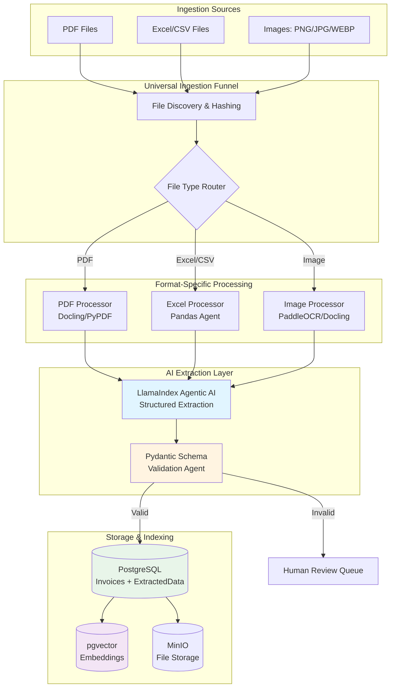
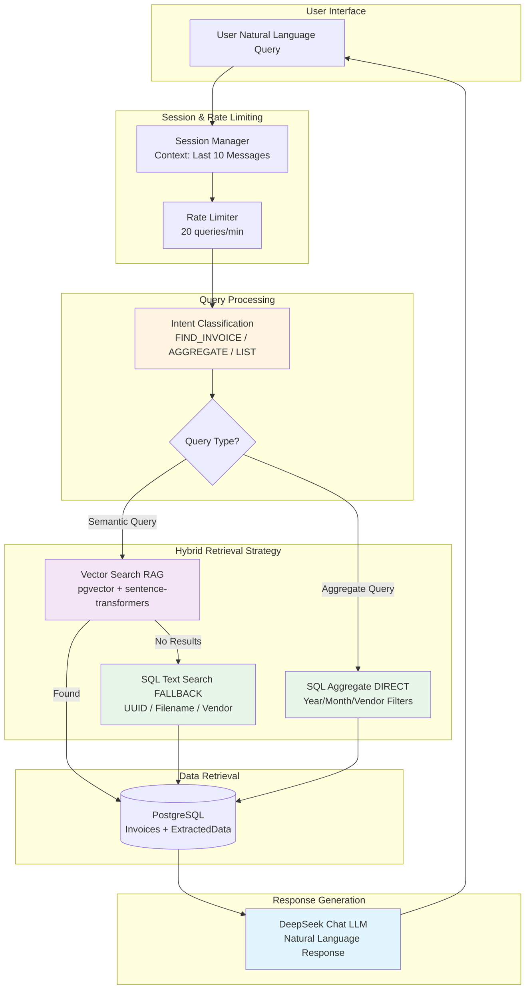

# AI-Invoice: AI-driven accounts payable automation

An **AI-native financial automation platform** for processing heterogeneous invoice formats (PDF, Excel, Images) into structured data. Leveraging **Agentic AI** for "Zero-Template" extraction and self-correcting validation.

Automates the full invoice lifecycle — ingestion, extraction, validation, and routing — using LLM agents and ETL pipelines. Eliminates manual data entry from financial document processing for enterprise finance teams.

**Services:**
Invoice ingestion, Data extraction, GL coding, Approval routing, ERP integration

**Highlights:**
- LLM agent pipeline: Handles variable layouts
- Multi-format input: PDF, scan, email, EDI
- Exception handling: Flags anomalies automatically
- Audit trail: Full traceability per document

## 🆕 Key capabilities under development

• Autonomous document intake agent: classifies document type, origin, and quality before routing
• OCR + LLM extraction agent: fuses OCR output with LLM semantic parsing to reconstruct structured
invoice data
• Hybrid retrieval agent: resolves vendor identity, GL codes, and PO matching via Vector + SQL
parallel search
• Validation and exception agent: detects anomalies, flags low-confidence fields, and escalates for
human review
• Reconciliation agent: posts validated entries to accounting schemas and generates audit trails


## 📸 Implementation at a Glance

| Overview | Invoice List & Bulk Actions |
|----------|-----------------------------|
|  |  |

| Invoice Detail & Extracted Data | Validation Analysis |
|----------------------------------|---------------------|
|  |  |

| Upload Files | Chat with Invoices |
|--------------|--------------------|
|  |  |

| Quality Metrics | Financial Summary |
|-----------------|-------------------|
|  |  |

---

## 🚀 Quick Start

### 1. Prerequisites
- Python 3.12.2+
- Docker and Docker Compose
- PostgreSQL (Automated via Docker)

docker-compose up -d

### 2. Setup & Start
```bash
# Full environment setup (venv, dependencies, .env, DB, migrations)
./bin/setup.sh

# Start API server (with reload for development)
./bin/api.sh start

# Start API server in safe mode (no reload, for batch)
./bin/api.sh safe

# Restart API server
./bin/api.sh restart

# Start Dashboard (Port 8501)
./bin/dashboard.sh
```

---

## 📄 Usage


### Process Invoices
Batch process all invoices in the `data/` directory:
```bash
./bin/process_invoices.sh
# Or use python scripts/process_invoices.py with custom options
```

Or via API:
```bash
curl -X POST "http://localhost:8000/api/v1/invoices/process" \
  -H "Content-Type: application/json" \
  -d '{"file_path": "invoice-1.png"}'
```

### View Results
- **Dashboard**: [http://localhost:8501](http://localhost:8501)
- **API Docs**: [http://localhost:8000/docs](http://localhost:8000/docs)

---

## 🏗️ Technical Overview

| Layer | Technology |
| :--- | :--- |
| **Persistence** | PostgreSQL (`pgvector`, `pgqueuer`) |
| **Logic** | LlamaIndex, DeepSeek, Docling |
| **Interface** | FastAPI, Streamlit |

---

## � Processing Pipeline Workflows

### 1️⃣ Invoice Ingestion & Processing Pipeline

Documents are processed **once** during ingestion, with extracted data stored for later querying:


```mermaid
graph TB
    subgraph "Ingestion Sources"
        A1[PDF Files]
        A2[Excel/CSV Files]
        A3[Images: PNG/JPG/WEBP]
    end
    
    subgraph "Universal Ingestion Funnel"
        B[File Discovery & Hashing]
        C{File Type Router}
    end
    
    subgraph "Format-Specific Processing"
        D1[PDF Processor<br/>Docling/PyPDF]
        D2[Excel Processor<br/>Pandas Agent]
        D3[Image Processor<br/>PaddleOCR/Docling]
    end
    
    subgraph "AI Extraction Layer"
        E[LlamaIndex Agentic AI<br/>Structured Extraction]
        F[Pydantic Schema<br/>Validation Agent]
    end
    
    subgraph "Storage & Indexing"
        G[(PostgreSQL<br/>Invoices + ExtractedData)]
        H[(pgvector<br/>Embeddings)]
        I[(MinIO<br/>File Storage)]
    end
    
    A1 --> B
    A2 --> B
    A3 --> B
    B --> C
    
    C -->|PDF| D1
    C -->|Excel/CSV| D2
    C -->|Image| D3
    
    D1 --> E
    D2 --> E
    D3 --> E
    
    E --> F
    F -->|Valid| G
    F -->|Invalid| J[Human Review Queue]
    
    G --> H
    G --> I
    
    style E fill:#e1f5ff
    style F fill:#fff4e1
    style G fill:#e8f5e9
    style H fill:#f3e5f5
```

**Key Points:**
- **Zero-Template Extraction**: AI reads and reasons about layout variations without hardcoded templates
- **Validation with Auto-Retry**: Failed validations trigger alternative extraction strategies before human review
- **Embeddings**: Generated during ingestion for semantic search (optional, chatbot falls back to SQL if unavailable)

**On the way:**
- LangGraph Multi-Agent Orchestration
- Hybrid Retrieval Subsystem

---

### 2️⃣ RAG Chat Query Pipeline (Separate from Ingestion)

The chatbot queries **already-processed** data using a hybrid retrieval strategy:


```mermaid
graph TB
    subgraph "User Interface"
        U[User Natural Language Query]
    end
    
    subgraph "Session & Rate Limiting"
        S1[Session Manager<br/>Context: Last 10 Messages]
        S2[Rate Limiter<br/>20 queries/min]
    end
    
    subgraph "Query Processing"
        Q1[Intent Classification<br/>FIND_INVOICE / AGGREGATE / LIST]
        Q2{Query Type?}
    end
    
    subgraph "Hybrid Retrieval Strategy"
        R1[Vector Search RAG<br/>pgvector + sentence-transformers]
        R2[SQL Text Search FALLBACK<br/>UUID / Filename / Vendor]
        R3[SQL Aggregate DIRECT<br/>Year/Month/Vendor Filters]
    end
    
    subgraph "Data Retrieval"
        D[(PostgreSQL<br/>Invoices + ExtractedData)]
    end
    
    subgraph "Response Generation"
        L[DeepSeek Chat LLM<br/>Natural Language Response]
    end
    
    U --> S1
    S1 --> S2
    S2 --> Q1
    Q1 --> Q2
    
    Q2 -->|Semantic Query| R1
    Q2 -->|Aggregate Query| R3
    
    R1 -->|No Results| R2
    R1 -->|Found| D
    R2 --> D
    R3 --> D
    
    D --> L
    L --> U
    
    style Q1 fill:#fff4e1
    style R1 fill:#f3e5f5
    style R2 fill:#e8f5e9
    style R3 fill:#e8f5e9
    style L fill:#e1f5ff
```

**Key Points:**
- **Cascading Fallback Strategy**: Vector search (RAG) → SQL text search → SQL aggregates
- **Intent-Based Routing**: Different query types use optimal retrieval methods
- **No Re-Processing**: Queries only read stored data; no re-extraction happens
- **Future Enhancement**: True parallel hybrid search (vector + SQL with RRF) documented but not yet implemented

---

## �📚 Documentation
- **[Technical Stack & Architecture](./docs/tech-stack.md)** — Stack by layer, alternatives, and processing logic.
- **[Setup & Scaffold](./docs/setup-scaffold-1.md)** — Step-by-step implementation guide.
- **[Dashboard Improvements](./docs/002-dashboard-improvements.md)** — Analytics, export, filters, and bulk actions.
- **[Dataset Upload UI](./docs/003-dataset-upload-ui-implementation.md)** — Web upload and processing flow.
- **[Invoice Chatbot](./docs/004-invoice-chatbot-implementation.md)** — RAG-backed chat over invoice data.
- **[Duplicate Processing Logic](./docs/duplicate-processing-logic.md)** — Hashing and versioning.
- **[Resilient Configuration](./docs/resilient-configuration.md)** — Module plugability and runtime configuration APIs.
- **[Docs Index](./docs/README.md)** — Full documentation index and RAG stack analysis.
