# AI-eInvoicing vs AI-eDocuments: Technical Architecture Comparison

**Analysis Date**: February 3, 2026  
**Document Purpose**: Deep comparison of two AI-powered document processing platforms

---

## 📊 Executive Summary

| Aspect | AI-eInvoicing | AI-eDocuments (AgenticOmni) |
|--------|--------------|----------------------------|
| **Domain Focus** | Financial invoice processing | General document intelligence |
| **Architecture Pattern** | "Complexity Collapse" - All-in-Postgres | ETL-to-RAG Pipeline |
| **Primary Use Case** | Zero-template invoice extraction | Multi-format document search |
| **UI Approach** | Streamlit (monolithic dashboard) | Next.js (modern SPA) |
| **Queue System** | pgqueuer (Postgres-native) | Dramatiq + Redis |
| **Validation Strategy** | Agentic self-correction | Upload validation only |
| **Deployment Model** | Single-stack Python | Full-stack (Python + TypeScript) |

---

## 🏗️ Architecture Comparison

### System Architecture Diagrams

#### AI-eInvoicing Architecture


#### AI-eDocuments Architecture


---

## 🔧 Technology Stack Deep Dive

### Core Dependencies Comparison

| Category | AI-eInvoicing | AI-eDocuments |
|----------|--------------|---------------|
| **Python Version** | ≥3.12.2 | ≥3.12 |
| **Web Framework** | FastAPI 0.115+ | FastAPI 0.109+ |
| **ASGI Server** | uvicorn[standard] 0.32+ | uvicorn[standard] 0.27+ |
| **Database Driver** | asyncpg 0.30+ | asyncpg 0.29+ |
| **ORM** | SQLAlchemy 2.0.36+ (asyncio) | SQLAlchemy 2.0.25+ (asyncio) |
| **Migrations** | Alembic 1.14+ | Alembic 1.13+ |
| **Validation** | Pydantic 2.9+ | Pydantic 2.5+ |

### Document Processing Stack

| Component | AI-eInvoicing | AI-eDocuments |
|-----------|--------------|---------------|
| **PDF Parsing** | ✅ Docling 1.0+ <br/> ✅ PyPDF 5.0+ | ✅ Docling 1.0+ <br/> ✅ PyPDF 4.0+ |
| **DOCX Support** | ❌ Not implemented | ✅ python-docx 1.1+ |
| **Excel Processing** | ✅ Pandas 2.2+ <br/> ✅ openpyxl 3.1+ | ❌ Not primary focus |
| **OCR Engine** | ✅ PaddleOCR 2.7+ | ✅ Tesseract (pytesseract) <br/> ✅ PaddleOCR 2.7+ |
| **Image Processing** | ✅ PaddlePaddle 2.6+ | ✅ Pillow 10.2+ <br/> ✅ OpenCV 4.9+ |
| **File Type Detection** | ✅ Manual logic | ✅ python-magic 0.4.27 |
| **Malware Scanning** | ❌ Not implemented | ✅ ClamAV (clamd 1.0.2) |

### AI/LLM Framework Comparison

| Component | AI-eInvoicing | AI-eDocuments |
|-----------|--------------|---------------|
| **RAG Framework** | ✅ LlamaIndex 0.11+ <br/> *Primary orchestrator* | ✅ LangChain 0.1+ <br/> ✅ LlamaIndex 0.9+ <br/> *Dual framework* |
| **LLM Providers** | ✅ OpenAI 1.50+ <br/> ✅ DeepSeek 1.0+ <br/> ✅ Google Gemini | ✅ OpenAI 1.10+ <br/> ✅ Anthropic 0.8+ |
| **Embeddings** | ✅ sentence-transformers 5.0+ <br/> ✅ OpenAI embeddings | ✅ sentence-transformers 2.3+ <br/> ✅ Ollama (nomic-embed-text) |
| **Vector Store** | ✅ pgvector 0.2+ | ✅ pgvector 0.2.4+ (1536 dimensions) |
| **Tokenization** | *LlamaIndex built-in* | ✅ tiktoken 0.5.2+ |

### Task Queue Architecture

#### AI-eInvoicing: pgqueuer (Postgres-Native)

```python
# core/queue.py
import asyncpg
from pgqueuer import PgQueuer, Queries, AsyncpgDriver

# Single Postgres connection for both queue and data
_worker_conn = await asyncpg.connect(database_url)
_pgq = PgQueuer.from_asyncpg_connection(_worker_conn)

# Enqueue jobs
queries = Queries(AsyncpgDriver(_enqueuer_conn))
await queries.enqueue(job_type, payload)
```

**Philosophy**: "All-in-Postgres" - No separate queue service needed

#### AI-eDocuments: Dramatiq + Redis

```python
# Dramatiq task definition
import dramatiq
from dramatiq.brokers.redis import RedisBroker

redis_broker = RedisBroker(url="redis://localhost:6379")
dramatiq.set_broker(redis_broker)

@dramatiq.actor
async def process_document_task(document_id: int):
    # Background processing
    pass
```

**Philosophy**: Separation of concerns - Redis for queue, Postgres for data

### Frontend Architecture

| Aspect | AI-eInvoicing | AI-eDocuments |
|--------|--------------|---------------|
| **Framework** | Streamlit 1.39+ | Next.js 16.1.1 (App Router) |
| **Language** | Python | TypeScript 5+ |
| **UI Components** | Streamlit built-in | shadcn/ui + Radix UI |
| **Styling** | Streamlit theming | Tailwind CSS 4 |
| **State Management** | Session state (server-side) | React hooks + client state |
| **Rendering** | Server-side streaming | SSR/SSG + Client hydration |
| **Real-time Updates** | WebSocket (built-in) | API polling / WebSocket |
| **Build Tool** | N/A (interpreted) | Next.js bundler |
| **Deployment** | Single Python process | Separate Node.js server |

---

## 📐 Data Model Comparison

### AI-eInvoicing Schema


### AI-eDocuments Schema


---

## 🎯 Core Feature Comparison

### Invoice Processing vs Document Intelligence

| Feature | AI-eInvoicing | AI-eDocuments |
|---------|--------------|---------------|
| **Primary Goal** | Extract structured invoice data | Index & search documents |
| **Extraction Strategy** | Agentic LLM with retry logic | ETL pipeline with RAG |
| **Validation** | ✅ Mathematical validation <br/> ✅ Business rules <br/> ✅ Auto-retry on failure | ✅ File type validation <br/> ✅ Size limits <br/> ✅ Malware scanning |
| **Output Format** | Pydantic schema (ExtractedDataSchema) | Text chunks + embeddings |
| **Error Handling** | Multi-strategy retry (3 attempts) | Job retry API endpoint |
| **Quality Metrics** | ✅ Confidence scores <br/> ✅ Validation pass/fail rates | ❌ Not implemented |
| **Human-in-the-Loop** | ✅ Dashboard for failed validations | ✅ Manual retry for failed jobs |

### Processing Pipeline Workflows

#### AI-eInvoicing: Agentic Validation Loop


#### AI-eDocuments: ETL-to-RAG Pipeline


---

## 🚀 Deployment & Operations

### Docker Compose Comparison

#### AI-eInvoicing

```yaml
services:
  postgres:
    image: pgvector/pgvector:pg16
    ports: ["5432:5432"]
    volumes:
      - postgres_data:/var/lib/postgresql/data
    # Single service - queue built into Postgres
```

**Services**: 1 (PostgreSQL with pgvector)  
**Startup Time**: ~10 seconds

#### AI-eDocuments

```yaml
services:
  postgres:
    image: ankane/pgvector:v0.5.1
    ports: ["5436:5432"]
  
  redis:
    image: redis:7-alpine
    ports: ["6380:6379"]
    command: redis-server --appendonly yes
  
  clamav:
    image: clamav/clamav:latest
    profiles: [clamav]  # Optional
    ports: ["3310:3310"]
```

**Services**: 2-3 (PostgreSQL, Redis, optional ClamAV)  
**Startup Time**: ~30 seconds (300s for ClamAV virus definitions)

### Running the Applications

| Task | AI-eInvoicing | AI-eDocuments |
|------|--------------|---------------|
| **Start Database** | `docker-compose up -d` | `docker-compose up -d` |
| **Run Migrations** | `alembic upgrade head` | `alembic upgrade head` |
| **Start API** | `python interface/api/main.py --reload` | `./scripts/run_dev.sh` or<br/>`uvicorn src.api.main:app --reload` |
| **Start UI** | `streamlit run interface/dashboard/app.py` | `cd frontend && npm run dev` |
| **Process Documents** | `python scripts/process_invoices.py` | Upload via web UI or API |
| **API Port** | 8000 | 8000 |
| **UI Port** | 8501 | 3000 |

---

## 🧪 Testing & Code Quality

### Test Infrastructure

| Aspect | AI-eInvoicing | AI-eDocuments |
|--------|--------------|---------------|
| **Test Framework** | pytest 8.3+ | pytest 8.0+ |
| **Async Testing** | pytest-asyncio 0.24+ | pytest-asyncio 0.23+ |
| **Coverage Tool** | pytest-cov (implicit) | pytest-cov 4.1+ |
| **Coverage Target** | 60% overall, 80% core logic | Not specified |
| **Test Categories** | unit, integration, contract, e2e | unit, integration (via fixtures) |
| **Mock Strategy** | Mock MinIO, ERP, external APIs | Mock Redis, S3, external services |
| **Linter** | Ruff 0.6+ | Ruff 0.1.14+ |
| **Type Checker** | mypy 1.11+ | mypy 1.8+ |
| **Type Hints** | **Mandatory** (constitution requirement) | Optional but recommended |

### Code Quality Standards

#### AI-eInvoicing (Constitution-Mandated)

From [.specify/memory/constitution.md](/.specify/memory/constitution.md):

- ✅ **Type hints REQUIRED** for all function signatures
- ✅ Functions MUST be <50 lines
- ✅ Error handling MUST be explicit (no silent failures)
- ✅ **Test-first workflow**: Write tests → Get approval → Implement
- ✅ Dependencies MUST be pinned versions

Example:
```python
def extract_invoice_data(
    raw_text: str, 
    metadata: dict[str, Any] | None = None
) -> ExtractedDataSchema:
    """Extract structured invoice data.
    
    Raises:
        FileNotFoundError: If file_path does not exist
        ValidationError: If extracted data fails schema validation
    """
```

#### AI-eDocuments (Pragmatic)

- ✅ Type hints encouraged
- ✅ Structured logging (structlog)
- ✅ Custom exception classes
- ✅ Middleware for error handling

Example:
```python
async def get_db() -> AsyncGenerator[AsyncSession, None]:
    """Get an async database session.
    
    Yields:
        AsyncSession: Database session
    """
```

---

## 🎨 User Interface Comparison

### Dashboard Features

| Feature | AI-eInvoicing (Streamlit) | AI-eDocuments (Next.js) |
|---------|--------------------------|-------------------------|
| **Invoice/Document List** | ✅ Table with filters | ✅ Table with pagination |
| **Detail View** | ✅ Full invoice + validation | ✅ Document metadata |
| **File Preview** | ✅ Inline preview | ❌ Not implemented |
| **Bulk Actions** | ✅ Bulk reprocess | ❌ Not implemented |
| **Export** | ✅ CSV, PDF | ❌ Not implemented |
| **Analytics** | ✅ Charts (Plotly) | ❌ Not implemented |
| **Chatbot** | ✅ RAG-based Q&A | ❌ Not implemented |
| **Search** | ✅ Basic filtering | ✅ Semantic vector search |
| **Upload UI** | ✅ Drag-and-drop | ✅ Drag-and-drop (batch) |
| **Real-time Updates** | ✅ Auto-refresh | ✅ Progress tracking |

### UI Code Examples

#### Streamlit (AI-eInvoicing)

```python
# interface/dashboard/app.py
st.set_page_config(page_title="E-Invoice Review", layout="wide")
st.title("📄 E-Invoice Review Dashboard")

# Filters
col1, col2, col3 = st.columns(3)
with col1:
    status_filter = st.multiselect("Status", ["completed", "failed"])
with col2:
    date_range = st.date_input("Date Range", [])
    
# Display table
df = asyncio.run(get_invoice_list(filters))
st.dataframe(df, use_container_width=True)

# Charts
fig = create_status_distribution_chart(data)
st.plotly_chart(fig)
```

**Pros**: 
- ⚡ Rapid development
- 🐍 Pure Python (no frontend skills needed)
- 📊 Built-in charts & widgets

**Cons**:
- 🐌 Limited customization
- 🔄 Full page reloads
- 📱 Poor mobile UX

#### Next.js (AI-eDocuments)

```typescript
// frontend/app/upload/page.tsx
export default function UploadPage() {
  const [files, setFiles] = useState<File[]>([]);
  
  const handleUpload = async () => {
    const formData = new FormData();
    files.forEach(file => formData.append('files', file));
    
    const res = await fetch('/api/v1/documents/batch-upload', {
      method: 'POST',
      body: formData
    });
    
    const data = await res.json();
    router.push(`/documents/${data.batch_id}`);
  };
  
  return (
    <div className="container mx-auto p-6">
      <Dropzone onDrop={setFiles} />
      <Button onClick={handleUpload}>Upload</Button>
    </div>
  );
}
```

**Pros**:
- 🚀 Modern UX
- 📱 Responsive design
- ⚡ Client-side routing
- 🎨 Full styling control

**Cons**:
- 📚 Steeper learning curve
- 🔧 More setup required
- 👨‍💻 Requires frontend skills

---

## 💡 Key Design Philosophies

### AI-eInvoicing: "Complexity Collapse"

**Core Principle**: Maximize intelligence, minimize infrastructure

1. **All-in-Postgres**: No separate Redis, RabbitMQ, or vector DB
2. **Agentic Validation**: LLM self-corrects extraction errors
3. **Zero-Template**: Layout changes don't break extraction
4. **Cost Optimization**: Self-hosted over cloud services
5. **Type Safety**: Mandatory type hints for financial data

**Trade-offs**:
- ✅ Lower operational complexity
- ✅ Reduced cloud costs
- ✅ Simpler deployment
- ❌ Postgres becomes single point of failure
- ❌ Limited to Postgres scalability

### AI-eDocuments: "Separation of Concerns"

**Core Principle**: Modular ETL-to-RAG pipeline

1. **Service Separation**: Redis for queue, Postgres for data, S3 for blobs
2. **Multi-tenant Architecture**: Tenant isolation built-in
3. **Dual RAG Frameworks**: LangChain + LlamaIndex flexibility
4. **Security First**: Malware scanning, magic byte validation
5. **Modern Stack**: TypeScript frontend, async Python backend

**Trade-offs**:
- ✅ Better scalability
- ✅ Clear service boundaries
- ✅ Modern UX
- ❌ More services to manage
- ❌ Higher operational overhead

---

## 📈 Performance Considerations

### AI-eInvoicing Performance Targets

From constitution requirements:
- Invoice extraction: **p95 <3s** (PDF/Excel), **p99 <5s**
- Database queries: **p95 <100ms** (dashboard), **p95 <500ms** (analytics)
- Concurrent processing: **50 invoices** without degradation
- Memory: **<2GB** per worker process

### AI-eDocuments Performance Characteristics

Not explicitly documented, but inferred:
- Document upload: Async processing (no blocking)
- Embeddings: Batch generation via script
- Search: Vector similarity (pgvector indexing)
- Frontend: Next.js SSR/SSG optimization

---

## 🔐 Security & Multi-tenancy

| Feature | AI-eInvoicing | AI-eDocuments |
|---------|--------------|---------------|
| **Multi-tenant Support** | ❌ Not implemented | ✅ Built-in (tenant_id, user_id) |
| **Authentication** | ❌ Not implemented | 🟡 Planned (security_auth module) |
| **Authorization** | ❌ Not implemented | 🟡 Planned (RBAC) |
| **File Encryption** | ✅ Cryptography 43.0+ | ❌ Not implemented |
| **Malware Scanning** | ❌ Not implemented | ✅ ClamAV integration |
| **Content Hashing** | ✅ SHA-256 for duplicates | ✅ SHA-256 for duplicates |
| **SQL Injection Protection** | ✅ SQLAlchemy ORM | ✅ SQLAlchemy ORM |
| **Input Validation** | ✅ Pydantic | ✅ Pydantic + file validation |

---

## 🛠️ Development Workflow

### AI-eInvoicing: Speckit-Driven

Uses `.specify/` directory structure for specification-first development:

```bash
# 1. Create feature plan
.specify/scripts/bash/setup-plan.sh

# 2. Fill in specification documents
specs/feature-name/
  ├── spec.md          # User stories
  ├── plan.md          # Architecture
  ├── tasks.md         # Implementation phases
  └── checklists/      # Requirement tests

# 3. Write tests first (mandatory)
tests/unit/test_feature.py

# 4. Implement in phases
# Phase 1: Setup
# Phase 2: Foundation
# Phase 3+: User Stories

# 5. Check prerequisites
.specify/scripts/bash/check-prerequisites.sh --json
```

**Enforcement**: Constitution mandates test-first workflow

### AI-eDocuments: Conventional Agile

Standard Git workflow with documentation:

```bash
# 1. Create feature branch
git checkout -b feature/new-feature

# 2. Write code + tests
src/feature/
tests/feature/

# 3. Run tests
pytest tests/

# 4. Update docs
docs/feature-guide.md

# 5. Submit PR
git push origin feature/new-feature
```

**Flexibility**: More pragmatic, less process overhead

---

## 📦 Package Management

### Dependency Pinning

#### AI-eInvoicing (Strict)

```toml
# pyproject.toml
dependencies = [
    "fastapi>=0.115.0",      # Minimum version
    "uvicorn[standard]>=0.32.0",
    "pydantic>=2.9.0",
    # All dependencies pinned to major.minor
]
```

**Rationale**: Financial data requires stability

#### AI-eDocuments (Balanced)

```toml
# pyproject.toml
dependencies = [
    "fastapi>=0.109.0",
    "uvicorn[standard]>=0.27.0",
    "pydantic>=2.5.0",
    # Minimum versions, allows patch updates
]
```

Plus separate `requirements.txt` with exact versions:
```
fastapi==0.128.0
pydantic==2.5.0
```

---

## 🔄 Migration Strategies

### Database Migrations

Both use Alembic, but different approaches:

#### AI-eInvoicing Migration

```python
# alembic/versions/925498b15ac8_add_metadata_columns.py
def upgrade() -> None:
    op.add_column('invoices', 
        sa.Column('file_preview_metadata', JSONB, nullable=True))
    op.add_column('invoices',
        sa.Column('processing_metadata', JSONB, nullable=True))
```

**Pattern**: Add JSONB columns for flexible metadata

#### AI-eDocuments Migration

```python
# migrations/versions/002_add_embeddings.py
def upgrade() -> None:
    op.create_table(
        'embeddings',
        sa.Column('id', sa.Integer, primary_key=True),
        sa.Column('embedding', Vector(1536))  # pgvector
    )
    op.execute('CREATE INDEX ON embeddings USING ivfflat (embedding vector_cosine_ops)')
```

**Pattern**: Structured tables with vector indexes

---

## 🎯 Use Case Recommendations

### When to Use AI-eInvoicing

✅ **Best For**:
- Financial document processing (invoices, receipts, POs)
- Organizations wanting to minimize cloud costs
- Teams with strong Python skills but weak frontend expertise
- Use cases requiring mathematical validation
- Scenarios needing agentic retry logic
- Self-hosted environments

❌ **Not Ideal For**:
- General document management
- Multi-tenant SaaS products
- Mobile-first applications
- Use cases requiring modern UX

### When to Use AI-eDocuments

✅ **Best For**:
- General document intelligence platforms
- Multi-tenant SaaS applications
- Teams with full-stack capabilities
- Use cases prioritizing search over extraction
- Organizations needing malware scanning
- Modern web applications

❌ **Not Ideal For**:
- Invoice-specific extraction
- Single-tenant deployments
- Teams without frontend skills
- Use cases requiring financial validation

---

## 🔮 Future Roadmap Implications

### AI-eInvoicing Evolution Path

Based on constitution and docs:

1. **ERP Integration**: SAP, Oracle, QuickBooks connectors
2. **Advanced Analytics**: Vendor analysis, spend tracking
3. **Duplicate Detection**: Enhanced hashing logic
4. **API Expansion**: RESTful endpoints for headless usage
5. **Next.js Migration?**: Possible UI modernization

### AI-eDocuments Evolution Path

From docs/next-steps.md and TODO:

1. **Authentication**: Complete security_auth module
2. **RAG Improvements**: Advanced chunking strategies
3. **OCR Completion**: Full pipeline for scanned documents
4. **Production Deploy**: Kubernetes, monitoring
5. **Evaluation Harness**: Metrics tracking (eval_harness module)

---

## 📊 Comparative Metrics

### Codebase Statistics

| Metric | AI-eInvoicing | AI-eDocuments |
|--------|--------------|---------------|
| **Primary Language** | Python (100%) | Python (~70%) + TypeScript (~30%) |
| **Backend Modules** | 4 (core, brain, ingestion, interface) | 6 (api, ingestion_parsing, storage_indexing, rag_orchestration, eval_harness, security_auth) |
| **Frontend Complexity** | Low (Streamlit) | High (Next.js + React) |
| **Configuration Files** | 4 (pyproject.toml, alembic.ini, pytest.ini, docker-compose.yml) | 7 (pyproject.toml, alembic.ini, docker-compose.yml, frontend/package.json, frontend/tsconfig.json, etc.) |
| **Startup Scripts** | 4 (bin/*.sh) | 8+ (scripts/*.sh) |

### Learning Curve

```mermaid
graph LR
    A[New Developer] --> B{Background?}
    B -->|Python Only| C[AI-eInvoicing: ⭐⭐☆☆☆]
    B -->|Full-Stack| D[AI-eDocuments: ⭐⭐⭐⭐☆]
    B -->|Frontend Only| E[AI-eDocuments Frontend: ⭐⭐⭐☆☆]
    
    C --> F[Learn: Streamlit, pgqueuer, LlamaIndex]
    D --> G[Learn: Next.js, Dramatiq, LangChain, Redis]
    E --> H[Learn: Next.js, TypeScript, Tailwind]
```



---

## 🎓 Lessons & Best Practices

### From AI-eInvoicing

1. **"All-in-Postgres" is viable** for single-tenant apps
2. **pgqueuer** eliminates need for RabbitMQ/Redis in many cases
3. **Agentic validation** reduces template maintenance
4. **Type hints** are non-negotiable for financial data
5. **Streamlit** enables rapid prototyping but limits UX

### From AI-eDocuments

1. **ETL-to-RAG** separation clarifies responsibilities
2. **Multi-tenant from day 1** prevents painful refactoring
3. **Next.js frontend** provides professional UX
4. **Dramatiq + Redis** is battle-tested for background jobs
5. **Dual RAG frameworks** (LangChain + LlamaIndex) offer flexibility

---

## 🔀 Cross-Pollination Opportunities

### What AI-eInvoicing Could Borrow

1. ✅ **Next.js Frontend**: Modernize UI beyond Streamlit
2. ✅ **Malware Scanning**: Add ClamAV for security
3. ✅ **Multi-tenancy**: Prepare for SaaS model
4. ✅ **File Magic Validation**: Better than extension checking
5. ✅ **Middleware Stack**: Request ID, logging middleware

### What AI-eDocuments Could Borrow

1. ✅ **pgqueuer**: Replace Dramatiq+Redis for simpler deployments
2. ✅ **Agentic Validation**: Add retry logic for extraction errors
3. ✅ **Analytics Dashboard**: Plotly charts for document metrics
4. ✅ **Export Features**: CSV/PDF generation
5. ✅ **Chatbot RAG**: Interactive Q&A over documents

---

## 🏁 Conclusion

### Summary Matrix

| Dimension | Winner | Reasoning |
|-----------|--------|-----------|
| **Simplicity** | 🏆 AI-eInvoicing | Fewer services, Python-only |
| **Scalability** | 🏆 AI-eDocuments | Service separation, multi-tenant |
| **User Experience** | 🏆 AI-eDocuments | Modern Next.js UI |
| **Domain Specificity** | 🏆 AI-eInvoicing | Invoice validation, agentic retry |
| **Security** | 🏆 AI-eDocuments | Malware scanning, multi-tenant auth |
| **Development Speed** | 🏆 AI-eInvoicing | Streamlit rapid prototyping |
| **Production Readiness** | 🏆 AI-eDocuments | Complete middleware, error handling |
| **Cost Efficiency** | 🏆 AI-eInvoicing | Fewer services to run |

### Final Verdict

**AI-eInvoicing** is a **specialized financial automation tool** optimized for invoice processing with minimal infrastructure. Ideal for single-tenant deployments where **cost and simplicity** trump modern UX.

**AI-eDocuments** is a **general-purpose document intelligence platform** designed for multi-tenant SaaS scenarios. Best for organizations prioritizing **scalability and user experience** over operational simplicity.

Both represent excellent architectural patterns for their respective domains, with clear lessons applicable to each other.

---

## 🔄 Orchestration & Multi-Agent Patterns

**Analysis Date**: February 4, 2026

### AI-eInvoicing: Pipeline + Job Queue Orchestration

**Pattern**: Sequential pipeline with specialized agents and pgqueuer for background jobs

**Main Orchestrator**: `ingestion/orchestrator.py`
- File ingestion → OCR processing → AI extraction → validation → self-correction → persistence
- Retry logic with 2 max attempts for OCR timeouts
- **pgqueuer** (PostgreSQL-based queue) for asynchronous job processing

**Specialized Agents** (Custom LLM orchestration, NOT LangGraph):

1. **Extractor Agent** (`brain/extractor.py`)
   - Direct LLM calls (OpenAI/DeepSeek/Gemini)
   - JSON-structured extraction with Pydantic validation
   - Self-correction via `refine_extraction()` based on validation feedback

2. **Validator Agent** (`brain/validator.py`)
   - Rule-based validation framework
   - Math checks (subtotal + tax = total)
   - Field presence and date validation

3. **Chatbot Agent** (`brain/chatbot/engine.py`)
   - RAG-based invoice querying with vector retrieval
   - Intent classification (FIND_INVOICE, AGGREGATE_QUERY, GENERAL_QUESTION)
   - Session management with 30-minute timeout

**Background Jobs**:
```python
# core/jobs.py - pgqueuer handlers
@pgq.entrypoint("process_invoice")
async def handle_process_invoice(job: Job):
    await process_invoice_handler(job)
```

**Self-Correction Loop**:
```python
# Validation-driven retry
extracted_data = await extract_invoice_data(raw_text)
validation_results = await validation_framework.validate(extracted_data)
if validation_failed:
    refined_data = await refine_extraction(raw_text, extracted_data, errors)
```

### AI-eDocuments: Service-Oriented Architecture

**Pattern**: Modular services with engine selection and async task spawning

**Main Orchestrator**: `src/ingestion_parsing/services/ocr_service.py`
- Upload service → OCR service → embedding service → storage
- Engine fallback: PaddleOCR → Tesseract
- **No queue system yet** (async tasks only)

**Service Composition**:

1. **Upload Service** (`upload_service.py`)
   - File validation, malware scanning, multi-tenant isolation
   
2. **OCR Service** (`ocr_service.py`)
   - Engine selection based on availability
   - Document processing with error handling
   - Result persistence to `ExtractedText` table

3. **Embedding Service** (planned)
   - Background embedding generation via `embedding_tasks.py`
   - Future Celery/ARQ integration

**Future Multi-Agent Plans**:
- **LangGraph installed** (`requirements.txt`) but not implemented
- Planned for Phase 3 RAG Orchestration module:
  ```
  rag_orchestration/
  ├── agents/        # LangGraph agentic workflows (PLANNED)
  ├── retrievers/    # Hybrid retrieval strategies
  └── pipelines/     # End-to-end RAG pipelines
  ```

### Orchestration Comparison

| Aspect | AI-eInvoicing | AI-eDocuments |
|--------|---------------|---------------|
| **Orchestration Style** | Pipeline-based (sequential) | Service-oriented (modular) |
| **Queue System** | ✅ pgqueuer (PostgreSQL) | ❌ None (async only) |
| **LangGraph Usage** | ❌ No (custom orchestration) | 📦 Installed, not implemented |
| **Multi-Agent Pattern** | ✅ 3 specialized agents | ⏳ Planned (RAG module) |
| **Self-Correction** | ✅ Auto-retry with feedback | ❌ Not implemented |
| **Background Processing** | ✅ Job handlers with pgqueuer | ⏳ Planned (Celery/ARQ) |
| **Retry Logic** | ✅ OCR timeout + validation retry | ✅ Basic error handling |
| **Agent Coordination** | Sequential pipeline control | Service composition |

### Key Insights

**Why AI-eInvoicing doesn't use LangGraph**:
- Invoice processing is linear (OCR → Extract → Validate → Store)
- Self-correction requires tight control over retry logic
- Custom LLM calls provide sufficient flexibility
- pgqueuer handles asynchronous needs without additional complexity

**Why AI-eDocuments plans LangGraph**:
- Document types vary (PDF, audio, video, images)
- Future RAG workflows need complex multi-step reasoning
- Agent coordination for cross-document analysis
- Multi-tenant scenarios require flexible query routing

**Shared "All-in-Postgres" Principle**:
- Both avoid external services (Redis, Pinecone, RabbitMQ)
- AI-eInvoicing: pgqueuer + pgvector
- AI-eDocuments: pgvector (queue pending)

### Orchestration Recommendations

**For AI-eInvoicing**:
- ✅ Current pipeline architecture is optimal for invoice processing
- Consider LangGraph only if adding complex multi-document reasoning
- pgqueuer provides excellent async job handling

**For AI-eDocuments**:
- ⚠️ Should adopt pgqueuer to maintain "All-in-Postgres" consistency
- LangGraph makes sense for future RAG agentic workflows
- Service boundaries support multi-tenancy well

Both apps demonstrate that **LangGraph is not required** for effective multi-agent orchestration. Direct LLM calls with custom validation loops can be more efficient for linear workflows, while service-oriented architecture works well for modular document processing systems.

---

**Document Metadata**:
- **Created**: February 3, 2026
- **Updated**: February 4, 2026 (Orchestration section)
- **Author**: GitHub Copilot (Claude Sonnet 4.5)
- **Lines**: 1200+
- **Mermaid Diagrams**: 5
- **Tables**: 28+
- **Code Examples**: 18+
