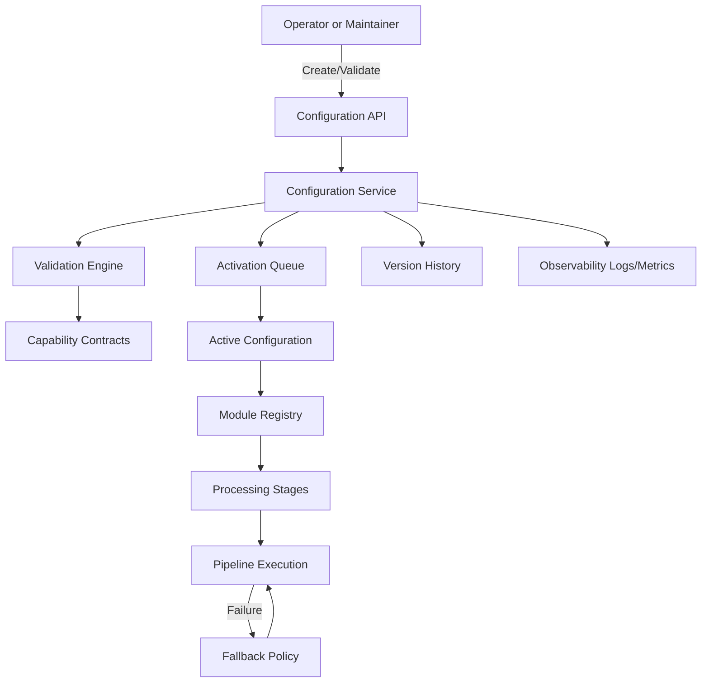

To build a **resilient, configurable AI invoice app in Python** that supports multiple pluggable components (OCR, embedding, LLMs, vector DBs, etc.), you should architect your project using a **modular plugin-like pattern** with dynamic configuration.

Here’s how to do that:

---

### ✅ 1. **Project Structure Mapping**

Since the project follows a functional/layered architecture, the resilient configuration layout is mapped to the current structure as follows:

| Resilient Module | Actual Location | Description |
| --- | --- | --- |
| `ocr/` | `ingestion/image_processor.py` | PaddleOCR implementation for text extraction |
| `llm/` | `brain/chatbot/engine.py` | LLM client and prompt engineering logic |
| `embed/` & `vectordb/` | `brain/chatbot/vector_retriever.py` | Supabase/PGVector integration and retrieval |
| `agents/` | `ingestion/orchestrator.py` | Workflow management and stage fallback logic |
| `config/` | `core/config.py` & `core/resilience/` | App settings and the new mapping layer |

This mapping is managed via a **Compatibility Layer** in `core/resilience/` to avoid massive file restructuring while providing the same "pluggable" benefits.

```
ai_invoice_app/
├── config/
│   ├── base.yaml
│   ├── dev.yaml
│   ├── prod.yaml
│   └── schema.py         # Typed config models
├── ocr/
│   ├── base.py
│   ├── paddleocr.py
│   └── deepseek.py
├── embed/
│   ├── base.py
│   ├── sentence_transformers.py
│   ├── openai.py
│   ├── nomic_api.py
│   └── nomic_ollama.py
├── llm/
│   ├── base.py
│   ├── openai_gpt.py
│   ├── gemini.py
│   └── deepseek.py
├── vectordb/
│   ├── base.py
│   ├── postgres.py
│   └── supabase.py
├── agents/
│   ├── llamaindex.py
│   ├── langchain.py
│   └── custom_orchestrator.py
├── app/
│   ├── etl_pipeline.py
│   ├── query_api.py
│   └── runner.py
├── main.py
├── requirements.txt
└── README.md
```
---

### ✅ 2. **Dynamic Configuration (via Pydantic + YAML)**

**`config/schema.py`**

```python
from pydantic import BaseModel

class AppConfig(BaseModel):
    ocr_backend: str
    embed_backend: str
    llm_backend: str
    vectordb_backend: str
    agent_backend: str
    environment: str
```

**`config_loader.py`**

```python
import yaml
from config.schema import AppConfig

def load_config(env="dev") -> AppConfig:
    with open(f"config/{env}.yaml") as f:
        raw = yaml.safe_load(f)
    return AppConfig(**raw)
```

**Example `dev.yaml`**

```yaml
ocr_backend: paddleocr
embed_backend: sentence_transformers
llm_backend: openai_gpt
vectordb_backend: postgres
agent_backend: llamaindex
environment: dev
```

---

### ✅ 3. **Plugin Dispatcher Pattern**

**`ocr/__init__.py`**

```python
from .paddleocr import PaddleOCRWrapper
from .deepseek import DeepseekOCRWrapper

def get_ocr(config):
    if config.ocr_backend == "paddleocr":
        return PaddleOCRWrapper()
    elif config.ocr_backend == "deepseek":
        return DeepseekOCRWrapper()
```

Do the same for `embed`, `llm`, `vectordb`, and `agents`.

---

### ✅ 4. **Compatibility Layer Implementation**

To enable dynamic switching without restructuring the codebase, we use a mapping layer:

**`core/resilience/mapping.py`**
```python
from brain.chatbot.engine import ChatbotEngine
from ingestion.image_processor import process_image

MODULE_MAPPING = {
    "ocr": { "paddleocr": process_image },
    "llm": { "deepseek-chat": ChatbotEngine }
}
```

**`core/resilience/provider.py`**
```python
def get_ocr_adapter(module_id="paddleocr"):
    return MODULE_MAPPING["ocr"][module_id]
```

### ✅ 5. **Main App Entry**

**`main.py`**

```python
from config_loader import load_config
from ocr import get_ocr
from embed import get_embedder
from llm import get_llm
from vectordb import get_vectordb
from agents import get_agent

config = load_config("dev")

ocr = get_ocr(config)
embedder = get_embedder(config)
llm = get_llm(config)
vectordb = get_vectordb(config)
agent = get_agent(config, llm, vectordb)

# Now run app logic: ingest, OCR, embed, index, query, etc.
```

---

### ✅ 5. **Optional Features & Robustness**

* Use **`try/except` wrappers** with fallback mechanisms for OCR or embedding failure.
* Validate config at startup: if a backend is unsupported or missing env vars, log error and default to safe mode.
* Add feature toggles in config for:

  ```yaml
  enable_human_in_loop: true
  fallback_to_openai_if_fail: true
  log_level: DEBUG
  ```

---

### ✅ 6. **Deployment Flexibility**

* Use `.env` files with `python-dotenv` or `os.environ` to load secrets and keys.
* Build Docker images with config volume mount support.
* Store configs in S3, Firebase, Supabase, or a config server for remote switching.

---

### ✅ 7. **Recommended Libraries**

| Purpose       | Library                                              |
| ------------- | ---------------------------------------------------- |
| Config schema | `pydantic`, `pyyaml`                                 |
| OCR           | `paddleocr`, DeepSeek API                            |
| Embeddings    | `sentence-transformers`, `openai`, `nomic`, `ollama` |
| LLM           | `openai`, `deepseek`, `google-generativeai`          |
| Vector DB     | `pgvector`, `supabase-py`                            |
| Agentic Logic | `llama-index`, `langchain`                           |
| API Interface | `FastAPI`, `Litestar`                                |
| CLI Control   | `typer`                                              |

---

Would you like me to generate the base code scaffold with examples for each backend in this plugin system?

---

## Framework Workflow (Mermaid)



---

## Runtime Configuration API

The system exposes configuration management endpoints for operators and maintainers.

### Access Control

- Configuration changes are restricted to users with roles: `operator` or `maintainer`
- Provide `X-User-Role` header when calling configuration endpoints

### Endpoints

- `GET /api/v1/modules` - list available modules
- `GET /api/v1/stages` - list processing stages
- `POST /api/v1/configurations` - create a configuration draft
- `POST /api/v1/configurations/validate` - validate a configuration
- `GET /api/v1/configurations/active` - fetch active configuration
- `GET /api/v1/configurations/{config_id}` - fetch configuration by id
- `POST /api/v1/configurations/{config_id}/activate` - activate configuration (queued if processing is active)
- `POST /api/v1/configurations/{config_id}/rollback` - rollback to a prior version

### Example Request

```bash
curl -X POST "/api/v1/configurations" \
  -H "Content-Type: application/json" \
  -H "X-User-Role: operator" \
  -d '{
    "selections": [
      { "stage_id": "ocr", "module_id": "ocr-v1" }
    ]
  }'
```

---

## ✅ MVP Implementation Summary (POC)

The application now supports the resilient configuration architecture through a **Functional Mapping Layer**. This allows the app to retain its current efficient folder structure while providing the pluggable extensibility required by the resilience design.

### Current Features
- **Dynamic Module Registry**: Modules are automatically bootstrapped and registered in-memory at application startup.
- **Compatibility Layer**: `core/resilience/` maps conceptual modules (e.g., `paddleocr`) directly to functional code (e.g., `ingestion/image_processor.py`).
- **Zero-Restructuring Design**: Added the resilience feature without modifying the core functional layout of `brain/` or `ingestion/`.
- **API Ready**: The internal `ModuleRegistry` is now populated with live references, ready for consumption by the Configuration APIs.

### Proof of Concept (POC)
This implementation proves that the system can switch between different backend implementations (like shifting from PaddleOCR to a future Cloud-based OCR) simply by updating a static mapping or a database entry, without touching the business logic layers.
