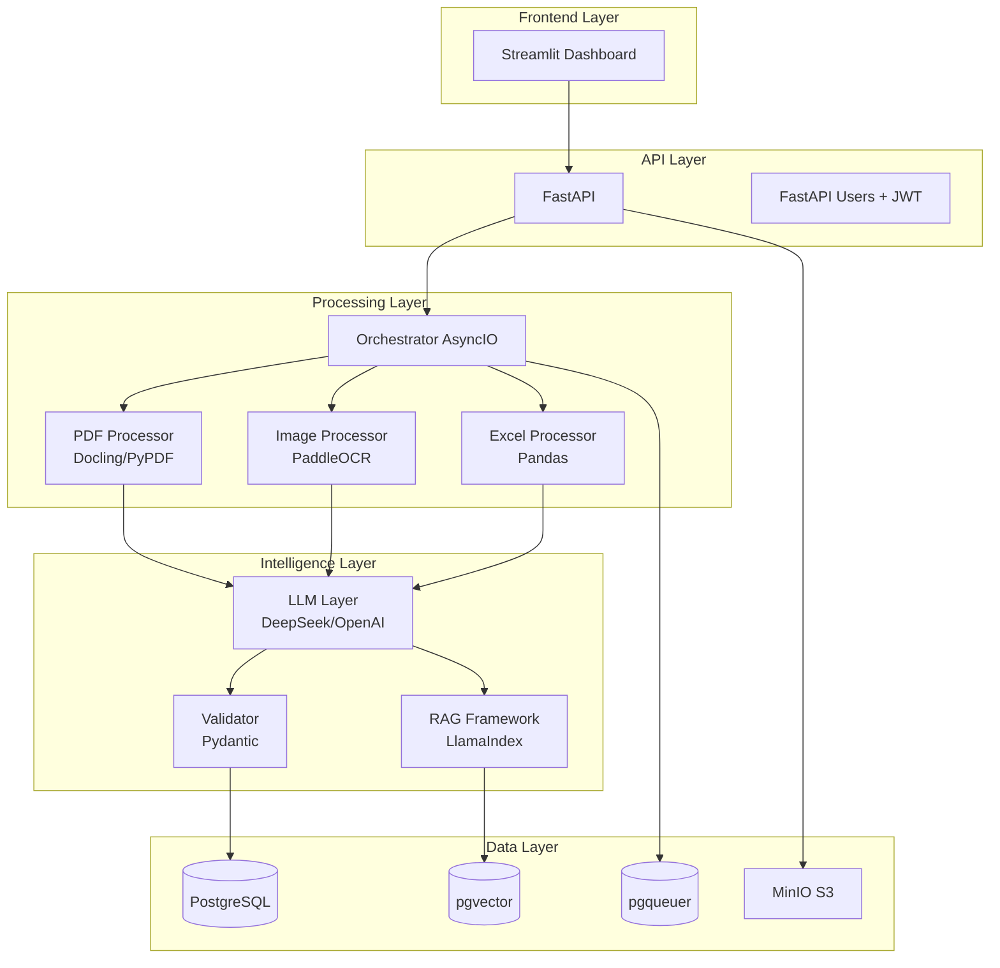
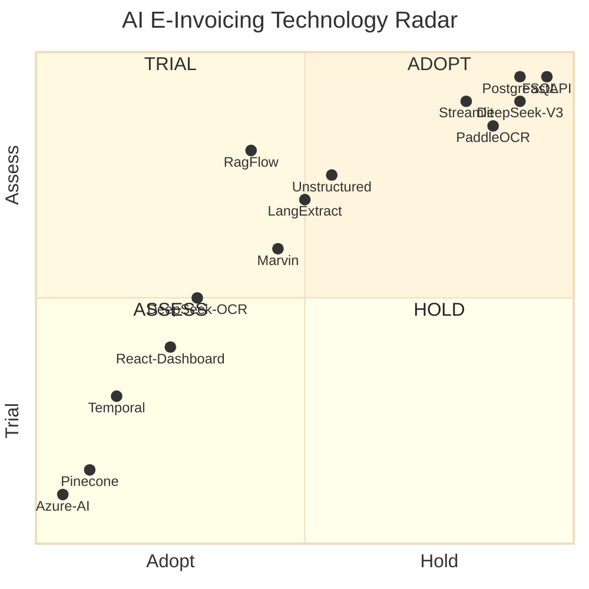

# Tech Stack & Alternative Solutions

> **Purpose**: This document catalogs the complete technology stack used in the AI e-Invoicing platform, along with viable alternatives for each component. It serves as a reference for architectural decisions and explores emerging solutions that could enhance or replace current implementations.

---

## 📐 Architecture Overview



---

## 🎯 Current Stack by Layer

### 1. Frontend / Interface Layer

| Component | Current Choice | Version | Purpose |
|-----------|---------------|---------|---------|
| **Dashboard UI** | Streamlit | 1.39.0+ | Interactive data visualization, HITL review |
| **PDF Viewer** | streamlit-pdf-viewer | Latest | In-app PDF preview |
| **Charting** | Plotly | 5.18.0+ | Quality metrics, trends visualization |

### 2. Backend / API Layer

| Component | Current Choice | Version | Purpose |
|-----------|---------------|---------|---------|
| **Web Framework** | FastAPI | 0.115.0+ | Async REST API, dependency injection |
| **ASGI Server** | Uvicorn | 0.32.0+ | High-performance async server |
| **Authentication** | fastapi-users + JWT | Latest | User management, token auth |
| **File Upload** | python-multipart | 0.0.12+ | Multipart form handling |
| **Validation** | Pydantic v2 | 2.9.0+ | Request/response schemas, data validation |

### 3. Document Processing Layer

| Component | Current Choice | Version | Purpose |
|-----------|---------------|---------|---------|
| **PDF Extraction** | Docling | 1.0.0+ | Layout-aware PDF to Markdown conversion |
| **PDF Fallback** | PyPDF | 5.0.0+ | Simple text extraction |
| **OCR Engine** | PaddleOCR | 2.7.0+ | Multi-language OCR (CPU optimized) |
| **OCR Framework** | PaddlePaddle | 2.6.0+ | Deep learning framework for OCR |
| **Excel/CSV Parser** | Pandas | 2.2.0+ | Tabular data ingestion |
| **Excel Binary** | openpyxl | 3.1.0+ | .xlsx file reading |
| **Markdown Export** | tabulate | (via pandas) | DataFrame to markdown conversion |

### 4. AI / Intelligence Layer

| Component | Current Choice | Version | Purpose |
|-----------|---------------|---------|---------|
| **LLM (Primary)** | DeepSeek-V3 | 1.0.0+ | Cost-effective structured extraction |
| **LLM (Fallback)** | OpenAI GPT-4o | 1.50.0+ | High-accuracy extraction |
| **RAG Framework** | LlamaIndex | 0.11.0+ | Document indexing, retrieval |
| **Embeddings** | sentence-transformers | 2.2.0+ | Semantic search, vector embeddings |
| **Orchestration** | AsyncIO (native) | Python 3.12 | Parallel processing, non-blocking I/O |

### 5. Data / Persistence Layer

| Component | Current Choice | Version | Purpose |
|-----------|---------------|---------|---------|
| **RDBMS** | PostgreSQL | 15+ | Core relational data storage |
| **ORM** | SQLAlchemy 2.0 | 2.0.36+ | Async ORM, migrations |
| **DB Driver** | asyncpg | 0.30.0+ | High-performance async PostgreSQL driver |
| **Migrations** | Alembic | 1.14.0+ | Schema version control |
| **Vector Store** | pgvector | 0.2.0+ | Embedding storage for semantic search |
| **Job Queue** | pgqueuer | 0.11.0+ | Background task processing |
| **Object Storage** | MinIO | Latest | S3-compatible document storage |

### 6. DevOps / Operations Layer

| Component | Current Choice | Version | Purpose |
|-----------|---------------|---------|---------|
| **Logging** | structlog | 24.4.0+ | Structured JSON logging |
| **Config Management** | pydantic-settings | 2.6.0+ | Environment-based configuration |
| **Encryption** | cryptography | 43.0.0+ | File encryption at rest |
| **Environment** | python-dotenv | 1.0.1+ | .env file management |
| **Container** | Docker Compose | Latest | Service orchestration |

### 7. Testing / Quality Layer

| Component | Current Choice | Version | Purpose |
|-----------|---------------|---------|---------|
| **Test Framework** | pytest | 8.3.0+ | Unit, integration, contract tests |
| **Async Testing** | pytest-asyncio | 0.24.0+ | Async test support |
| **HTTP Testing** | httpx | 0.27.0+ | API test client |
| **Linting** | ruff | 0.6.0+ | Fast Python linter |
| **Type Checking** | mypy | 1.11.0+ | Static type analysis |

---

## 🔄 Alternative Solutions & Comparisons

### Frontend / Dashboard Alternatives

| Technology | Pros | Cons | Use Case Fit |
|------------|------|------|--------------|
| **🟢 Streamlit** (Current) | • Rapid prototyping<br/>• Python-native<br/>• Built-in components<br/>• Easy HITL workflows | • Limited customization<br/>• Not ideal for public apps<br/>• Session state quirks | ✅ **Perfect for internal dashboards** |
| **React.js + Next.js** | • Highly customizable<br/>• Better performance<br/>• Modern UX patterns<br/>• Public-facing ready | • Requires separate frontend team<br/>• More boilerplate<br/>• Slower development | ⚠️ Consider for production SaaS version |
| **Gradio** | • Similar to Streamlit<br/>• Better for ML demos<br/>• Automatic API generation | • Less mature ecosystem<br/>• Fewer components | ⚠️ Alternative for quick ML demos |
| **Reflex** | • Python full-stack<br/>• React under the hood<br/>• Type-safe | • Very new (2023)<br/>• Limited community | 🔮 Watch for future adoption |
| **Dash (Plotly)** | • Enterprise-grade<br/>• Advanced visualizations<br/>• Production-ready | • Steeper learning curve<br/>• More verbose code | ⚠️ If heavy analytics focus |

### PDF Processing Alternatives

| Technology | Pros | Cons | Current Usage |
|------------|------|------|---------------|
| **🟢 Docling** (Current) | • Layout preservation<br/>• Table extraction<br/>• Markdown output<br/>• IBM-backed | • Newer project<br/>• GPU-heavy (optional) | ✅ Primary for complex PDFs |
| **PyPDF** (Fallback) | • Lightweight<br/>• Pure Python<br/>• Fast for simple PDFs | • No layout understanding<br/>• Poor table handling | ✅ Fallback only |
| **Unstructured.io** | • Multi-format support<br/>• Cloud & local<br/>• Active development | • Heavyweight dependency<br/>• Commercial licensing | 🟡 Strong alternative to Docling |
| **PyMuPDF (fitz)** | • Very fast<br/>• Image extraction<br/>• Low memory | • C++ dependency<br/>• License restrictions (AGPL) | 🟡 Consider for speed-critical paths |
| **pdfplumber** | • Table-focused<br/>• Visual debugging<br/>• Accurate coordinates | • Slower than PyMuPDF<br/>• Less layout context | 🟡 Good for table-heavy invoices |
| **Apache Tika** | • 1000+ formats<br/>• Battle-tested<br/>• Enterprise support | • Requires Java runtime<br/>• Heavier footprint | ❌ Too heavyweight for our use case |
| **Azure Document Intelligence** | • Excellent accuracy<br/>• Pre-trained invoice models<br/>• Microsoft support | • **High cost** ($1.50/1000 pages)<br/>• Cloud dependency<br/>• Vendor lock-in | ❌ Expensive for high volume |

### OCR Engine Alternatives

| Technology | Pros | Cons | Current Usage |
|------------|------|------|---------------|
| **🟢 PaddleOCR** (Current) | • Multi-language (80+)<br/>• CPU-friendly<br/>• Open-source<br/>• Chinese text excellent | • Model size ~200MB<br/>• Slower than Tesseract | ✅ Primary OCR engine |
| **DeepSeek-OCR** | • State-of-the-art accuracy<br/>• Multimodal understanding<br/>• Context-aware | • **Not publicly released yet**<br/>• Likely requires API<br/>• Unknown pricing | 🔮 **Monitor for release** - could replace PaddleOCR |
| **Tesseract 5.x** | • Fast<br/>• Lightweight<br/>• Ubiquitous | • Lower accuracy on Chinese<br/>• Requires preprocessing | 🟡 Good for English-only invoices |
| **EasyOCR** | • 80+ languages<br/>• PyTorch-based<br/>• Good accuracy | • GPU-hungry<br/>• Slower on CPU | 🟡 Alternative to PaddleOCR |
| **TrOCR (Hugging Face)** | • Transformer-based<br/>• SOTA accuracy<br/>• Fine-tunable | • Requires GPU<br/>• Larger models | ⚠️ Consider for GPU deployment |
| **Google Cloud Vision** | • Excellent accuracy<br/>• Handles handwriting<br/>• Managed service | • **$1.50/1000 images**<br/>• Privacy concerns<br/>• Network latency | ❌ Too expensive at scale |
| **AWS Textract** | • Invoice-specific<br/>• Key-value extraction<br/>• High accuracy | • **$0.015/page**<br/>• Vendor lock-in | ❌ Cost-prohibitive |

### LLM / Extraction Alternatives

| Technology | Pros | Cons | Current Usage |
|------------|------|------|---------------|
| **🟢 DeepSeek-V3** (Current) | • **$0.14/1M tokens** (input)<br/>• 128K context<br/>• Strong structured output<br/>• Function calling | • New model (Dec 2024)<br/>• Less tested than GPT | ✅ Primary for cost efficiency |
| **OpenAI GPT-4o** (Fallback) | • Proven reliability<br/>• Best-in-class reasoning<br/>• Vision support | • **$2.50/1M tokens**<br/>• 17x more expensive | ✅ Fallback for critical extractions |
| **Claude 3.5 Sonnet** | • Excellent at structured tasks<br/>• 200K context<br/>• Strong reasoning | • **$3/1M tokens**<br/>• Rate limits | 🟡 Consider for complex documents |
| **Gemini 1.5 Pro** | • 1M token context<br/>• Native multimodal<br/>• Competitive pricing | • Inconsistent quality<br/>• Regional availability | 🟡 Alternative to DeepSeek |
| **Qwen 2.5** | • Open weights<br/>• Self-hostable<br/>• Good Chinese support | • Requires GPU infrastructure<br/>• Lower accuracy than GPT | ⚠️ Consider for on-prem deployment |
| **Llama 3.1 (405B)** | • Open weights<br/>• Strong reasoning<br/>• Self-hostable | • **405B requires 8x A100s**<br/>• High infra cost | ❌ Too resource-intensive |

### RAG Framework Alternatives

| Technology | Pros | Cons | Current Usage |
|------------|------|------|---------------|
| **🟢 LlamaIndex** (Current) | • Document-centric<br/>• Rich ecosystem<br/>• Pydantic integration<br/>• Strong structured extraction | • Heavy dependency tree<br/>• Frequent breaking changes | ✅ Primary RAG framework |
| **LangChain** | • Most popular<br/>• Extensive integrations<br/>• Agent framework | • Overly complex abstractions<br/>• Slower updates | 🟡 Alternative if agent needs grow |
| **🔥 RagFlow** | • **Open-source RAG engine**<br/>• Built-in chunking strategies<br/>• Document parsing pipeline<br/>• Visual workflow designer<br/>• Multi-tenant support | • Newer project (2024)<br/>• Smaller community<br/>• Less mature docs | 🔮 **Strong alternative** - purpose-built for document AI |
| **Haystack** | • Production-ready<br/>• Pipeline-focused<br/>• Deepset support | • Steeper learning curve<br/>• Less structured extraction | 🟡 Consider for complex pipelines |
| **txtai** | • Lightweight<br/>• Embeddings-first<br/>• Fast indexing | • Fewer integrations<br/>• Simpler feature set | ⚠️ Good for simple semantic search |
| **🔥 LangExtract** | • **Zero-shot extraction**<br/>• No training needed<br/>• Schema-driven<br/>• Built on LangChain | • Less flexible than custom prompts<br/>• Still requires LLM API | 🔮 **Consider for quick wins** - simpler than custom prompts |
| **Marvin** | • Pydantic-native<br/>• Type-safe extraction<br/>• Elegant API | • Smaller ecosystem<br/>• Less documentation | 🟡 Alternative for Pydantic users |

### Database / Storage Alternatives

| Technology | Pros | Cons | Current Usage |
|------------|------|------|---------------|
| **🟢 PostgreSQL + pgvector** (Current) | • All-in-one solution<br/>• ACID guarantees<br/>• Mature ecosystem<br/>• Cost-effective | • Vector search slower than specialized DBs<br/>• Manual tuning needed | ✅ "Complexity Collapse" strategy |
| **Pinecone** | • Purpose-built vectors<br/>• Managed service<br/>• Fast similarity search | • **$70/month minimum**<br/>• Vendor lock-in | ❌ Unnecessary with pgvector |
| **Weaviate** | • Open-source vector DB<br/>• Hybrid search<br/>• Self-hostable | • Additional infrastructure<br/>• Overkill for our scale | ⚠️ Consider if vector search becomes bottleneck |
| **Qdrant** | • Rust-based speed<br/>• Filtering support<br/>• Good docs | • Another service to manage | ⚠️ Alternative to Weaviate |
| **Chroma** | • Lightweight<br/>• Embedded mode<br/>• Developer-friendly | • Less production-ready<br/>• Limited scale | ⚠️ Good for prototyping |

### Object Storage Alternatives

| Technology | Pros | Cons | Current Usage |
|------------|------|------|---------------|
| **🟢 MinIO** (Current) | • S3-compatible<br/>• Self-hosted<br/>• No egress fees | • Infrastructure overhead<br/>• Manual backups | ✅ Cost control strategy |
| **AWS S3** | • Managed service<br/>• 99.999999999% durability<br/>• Global CDN | • **Egress costs**<br/>• Vendor lock-in | 🟡 Consider for production SaaS |
| **Local Filesystem** | • Zero cost<br/>• Simple | • No redundancy<br/>• Not scalable | ❌ Development only |

### Background Job Processing Alternatives

| Technology | Pros | Cons | Current Usage |
|------------|------|------|---------------|
| **🟢 pgqueuer** (Current) | • Uses existing Postgres<br/>• ACID guarantees<br/>• Simple setup | • Not as feature-rich as Celery<br/>• Postgres becomes SPOF | ✅ Simplicity wins |
| **Celery** | • Battle-tested<br/>• Rich features<br/>• Monitoring tools | • Requires Redis/RabbitMQ<br/>• Complex setup | ⚠️ If job complexity grows |
| **Dramatiq** | • Simpler than Celery<br/>• Better API | • Smaller ecosystem | 🟡 Alternative to Celery |
| **Temporal** | • Workflow orchestration<br/>• Durable execution<br/>• Enterprise-grade | • Heavy infrastructure<br/>• Overkill for MVP | ❌ Too complex for current needs |

---

## 🚀 Emerging & Trending Solutions

### 🔥 High-Priority Alternatives to Evaluate

#### 1. **RagFlow** - Open-Source RAG Engine
- **Repository**: [infiniflow/ragflow](https://github.com/infiniflow/ragflow)
- **Stars**: ~20K+ (as of Jan 2025)
- **What it is**: A complete RAG engine with built-in document parsing, chunking, and retrieval
- **Key Advantages**:
  - ✅ **Visual workflow designer** - no-code pipeline building
  - ✅ **Built-in document parsers** - handles PDF, Word, Excel natively
  - ✅ **Intelligent chunking** - better than naive splitting
  - ✅ **Multi-tenant support** - SaaS-ready architecture
  - ✅ **Integrated UI** - reduces need for custom dashboard
- **When to Consider**:
  - If our LlamaIndex complexity grows
  - If we need multi-tenant isolation
  - If visual workflow management becomes valuable
- **Integration Path**:
  ```python
  # Could replace brain/ layer entirely
  # RagFlow handles: parsing → chunking → embedding → retrieval
  # We'd keep: validation, database, API layers
  ```

#### 2. **LangExtract** - Zero-Shot Extraction
- **Repository**: Part of LangChain ecosystem
- **What it is**: Schema-driven extraction without training examples
- **Key Advantages**:
  - ✅ **Simpler than custom prompts** - just define Pydantic schema
  - ✅ **Zero-shot** - no few-shot examples needed
  - ✅ **Type-safe** - leverages Pydantic validation
- **When to Consider**:
  - If we want to simplify `brain/extractor.py`
  - If prompt engineering becomes bottleneck
- **Example**:
  ```python
  from langextract import extract
  from pydantic import BaseModel
  
  class Invoice(BaseModel):
      vendor: str
      total: float
      date: str
  
  # That's it - no prompt engineering needed
  result = extract(Invoice, raw_text)
  ```

#### 3. **DeepSeek-OCR** - Next-Gen OCR (Unreleased)
- **Status**: Rumored/announced, not publicly available
- **Expected Advantages**:
  - ✅ **Multimodal understanding** - combines vision + text reasoning
  - ✅ **Context-aware** - understands invoice semantics during OCR
  - ✅ **Potential accuracy boost** - could eliminate extraction errors
- **Risk**: May require API access (not self-hostable)
- **Action**: **Monitor for release announcement** - could be game-changer

#### 4. **Docling + Unstructured.io** - Document Parsing Combo
- **Trend**: Using Docling for layout + Unstructured for preprocessing
- **Advantages**:
  - ✅ **Best of both worlds** - Docling's layout + Unstructured's robustness
  - ✅ **Better table handling** - especially for complex multi-page tables
- **When to Consider**: If current PDF extraction quality is insufficient

#### 5. **Marvin AI** - Pydantic-Native Extraction
- **Repository**: [PrefectHQ/marvin](https://github.com/PrefectHQ/marvin)
- **What it is**: AI engineering framework focused on type-safe extraction
- **Key Advantages**:
  - ✅ **Elegant API** - most Pythonic extraction library
  - ✅ **Zero boilerplate** - uses decorators
  - ✅ **Built-in validation** - Pydantic integration
- **Example**:
  ```python
  import marvin
  
  @marvin.fn
  def extract_invoice(text: str) -> ExtractedDataSchema:
      """Extract invoice data from text"""
  
  # That's the entire implementation
  result = extract_invoice(raw_text)
  ```

---

## 📊 Cost Comparison: Cloud vs Self-Hosted

### Scenario: 10,000 invoices/month

| Component | Cloud Solution | Monthly Cost | Our Stack | Monthly Cost |
|-----------|---------------|--------------|-----------|--------------|
| **OCR** | Google Vision | $150 | PaddleOCR (self-hosted) | $0 |
| **PDF Parsing** | Azure Document Intelligence | $150 | Docling (self-hosted) | $0 |
| **LLM Extraction** | GPT-4o only | $250 | DeepSeek-V3 primary | $35 |
| **Vector Database** | Pinecone | $70 | pgvector (in Postgres) | $0 |
| **Job Queue** | AWS SQS | $10 | pgqueuer (in Postgres) | $0 |
| **Object Storage** | AWS S3 | $50 | MinIO (self-hosted) | $10 |
| **Database** | AWS RDS | $200 | PostgreSQL (self-hosted) | $30 |
| **Total** | | **$880/month** | | **$75/month** |

**Cost Savings**: ~**90% reduction** using our "Complexity Collapse" approach

---

## 🎯 Decision Framework: When to Switch

### ✅ Stick with Current Stack If:
- MVP/early stage (current state)
- Processing < 50K invoices/month
- Team is Python-focused
- Infrastructure budget is limited

### ⚠️ Consider Alternatives If:
- Extraction accuracy < 85% (try DeepSeek-OCR when available)
- PDF parsing fails on >10% of documents (evaluate Unstructured.io)
- Processing time > 30s/invoice (optimize or add GPU)
- Team grows to include frontend specialists (consider React.js)

### 🔴 Must Switch If:
- Security audit requires zero-LLM-API-call mode (switch to self-hosted Llama)
- Scaling to 1M+ invoices/month (migrate to managed services)
- Multi-tenant SaaS launch (add RagFlow or similar isolation)

---

## 🛠️ Technology Radar (2025)



### Legend:
- **ADOPT (Top-Right)**: Current production stack - proven and reliable
- **TRIAL (Top-Left)**: Actively evaluate - RagFlow, LangExtract, Marvin
- **ASSESS (Bottom-Left)**: Monitor developments - DeepSeek-OCR, React dashboard
- **HOLD (Bottom-Right)**: Avoid - expensive cloud services

---

## 🧠 Understanding Processing

Each invoice goes through these stages:
1. **File Ingestion**: File is read and hashed (SHA-256) for duplicate detection
2. **OCR/Text Extraction**: Image/PDF is processed to extract text (PaddleOCR for images, Docling for PDFs)
3. **AI Extraction**: Structured data is extracted using DeepSeek-chat with manual JSON parsing for reliability (vendor, amounts, dates, etc.)
4. **Validation**: Business rules are checked (math validation, tax rate constraints, etc.)
5. **Self-Correction**: If validation fails, the system attempts to refine extraction by capping confidence and adjusting math logic
6. **Storage**: Results are stored in PostgreSQL with JSON-safe serialization

**Processing Status:**
- `pending` - Initial state
- `queued` - Added to processing queue
- `processing` - Currently being processed
- `completed` - Successfully processed
- `failed` - Processing failed (check error_message)

---

## 🛠️ Troubleshooting

### If processing fails:
- Check backend logs for error messages (logs include processing stage information)
- Verify the file exists in `data/` directory
- Check database connection in `.env` file: `DATABASE_URL` must be set
- Ensure all dependencies are installed: `pip install -e ".[dev]"`
- Run database migrations: `alembic upgrade head`
- Check file permissions: ensure `data/` directory is writable
- Verify file is not corrupted: check file size > 0
- Check for missing processing libraries (OCR, PDF): error messages will indicate which library is missing

### If dashboard shows no invoices:
- Make sure you've processed at least one invoice
- Check the status filter in the sidebar (may be filtering out your invoices)
- Verify database connection: check `.env` file has `DATABASE_URL`
- Check dashboard logs for database query errors
- Verify database schema is up to date: `alembic current` should show latest migration

### API not responding:
- Check if backend is running: `curl http://localhost:${API_PORT}/health`
- Verify port 8000 is not in use by another service
- Check API logs for startup errors
- Verify database is accessible: health endpoint will show "degraded" if database issues exist

---

## 📊 Current Implementation Status

### ✅ Completed (Scaffold Phase):
- Project structure with three-layer architecture (Sensory, Brain, Interaction)
- PostgreSQL database with pgvector extension
- Async SQLAlchemy 2.0 ORM models
- File processing pipeline (PDF, Excel, CSV, Images)
- Basic data extraction and validation framework
- FastAPI REST API with async endpoints
- Streamlit review dashboard
- File-level encryption at rest
- SHA-256 file hashing for duplicate detection
- Database migrations with Alembic

### ✅ Recently Completed (Ingestion Workflow Fixes):
- Non-blocking PaddleOCR initialization (prevents system crashes)
- Comprehensive error handling with user-friendly messages
- Database schema health checks and connection retry logic
- Enhanced logging with processing stage tracking
- OCR timeout handling with retry logic (180s default, up to 10min for large images)
- File validation (size limits, corruption checks)
- Background processing with proper session management
- Status tracking with immediate database commits
- Performance monitoring (processing time tracking)

### ✅ Completed (Agentic Phase):
- Docling integration for advanced PDF processing
- DeepSeek-chat integration as primary extraction LLM
- pgqueuer setup for background job management
- Enhanced validation rules (Tax rate auto-detection, Line item math fallback)
- Chatbot engine for conversational invoice querying
- Robust transaction management with explicit rollbacks

### 🚧 Future Roadmap:
- Multi-agent coordination for complex multi-page document reconciliation
- Integration with external ERP (Odoo/SAP) APIs
- Enhanced local embedding model performance tuning

---

## 📚 Further Reading & Resources

### Official Documentation
- [FastAPI Best Practices](https://fastapi.tiangolo.com/tutorial/)
- [LlamaIndex Structured Extraction](https://docs.llamaindex.ai/en/stable/examples/output_parsing/pydantic_structured_output/)
- [pgvector Performance Tuning](https://github.com/pgvector/pgvector#performance)
- [Streamlit Components Gallery](https://streamlit.io/components)

### Open-Source Projects to Watch
- **RagFlow**: https://github.com/infiniflow/ragflow
- **Docling**: https://github.com/DS4SD/docling
- **Marvin**: https://github.com/PrefectHQ/marvin
- **PaddleOCR**: https://github.com/PaddlePaddle/PaddleOCR

### Comparative Analysis
- [OCR Accuracy Benchmark 2024](https://paperswithcode.com/task/scene-text-recognition)
- [LLM Cost Comparison](https://artificialanalysis.ai/models)
- [Vector Database Benchmarks](https://qdrant.tech/benchmarks/)

### Alternative Ecosystems Worth Exploring
- **Document AI Platforms**: Azure Form Recognizer, AWS Textract (for accuracy baseline)
- **Workflow Orchestration**: Apache Airflow, Prefect, Temporal (if complexity grows)
- **Full-Stack Python**: Reflex, FastUI, NiceGUI (alternatives to React)

---

## 🔄 Version History

| Date | Change | Rationale |
|------|--------|-----------|
| 2025-01-08 | Initial document creation | Catalog current stack and alternatives |
| 2025-01-08 | Added RagFlow, LangExtract, Marvin | Popular emerging solutions in document AI space |
| 2025-01-08 | Added cost comparison | Justify "Complexity Collapse" approach |

---

## 💡 Contributing

This document should be updated when:
1. A major technology is added/replaced in the stack
2. A new promising alternative emerges in the ecosystem
3. Cost/performance benchmarks change significantly
4. Team makes a technology decision (document rationale here)

**Maintainer**: AI E-Invoicing Team
